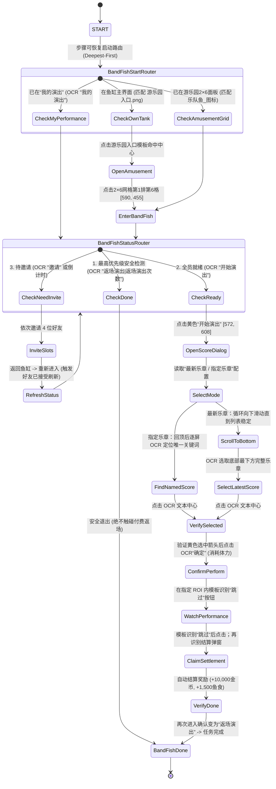

# 乐队鱼演出自动化 (docs/features/band-fish.md)

**最后更新**: 2026-09-24
**状态**: 导航与邀请流程已实现；用户已确认“最新乐章”从选曲、演奏到结算的完整流程通过 MFA 实测。19 首指定乐章尚未 MFA 实测。2026-09-22 独立任务发现人机好友就绪需约 3.5 分钟；2026-09-23 已为 PENDING 回访增加 60 秒间隔与 6 分钟上限。2026-09-24 主鱼缸入口从不稳定的“游乐园”艺术字 OCR 改为入口模板识别，本次未做模拟器复验。


---

## 一、功能定位与背景

开心水族箱游乐园「乐队鱼演出」自动化功能（`BandFishTask`）。  
通过自动化流程进入乐队鱼演出界面，将 4 位预设好友按槽位邀请入队，凑齐 5 位音乐家后触发演出，可选择最新乐章或任一已录入指定乐章，并完成每日演出产出。

### 稀缺资源与核心约束
- **每日仅有 1 次演出体力**：点击最终的演出确认键会立即消耗体力，且全天无法重置，属于极度稀缺资源；
- **防误邀机制**：必须严格匹配 4 位指定好友，绝不能邀请错人，严禁触发付费“雇佣”；
- **真实页面原则**：基于每次实机的实时截屏与 OCR bbox 进行动作决策，严禁硬编码卡片行列或经验偏移；
- **防钻石误触**：演出结束后界面变为“12💎返场演出”，状态机必须优先检测“返场演出”并安全退出，严禁点击付费返场；未确认目标乐章黄色选中态时，同样严禁点击消耗每日体力的“确定”。

### Start Contract

- `BandFishStartRouter` 按结算弹窗 → 正在演出（跳过按钮）→ 选曲弹窗 → 我的演出页 → 游乐园面板 → 主鱼缸排序。
- 选曲弹窗恢复复用本次 UI 的最新/指定乐章配置、OCR bbox、黄色选中态与标题/确定双门禁；未确认黄色选中态绝不消耗每日体力。
- 已在演出或结算时只恢复跳过/等待结算/领取结果，不重新进入、不重新点击演出确认；完成状态只沉淀一次。
- 好友邀请弹窗依赖丢失的 `target_slot` 与 `target_name` 运行时上下文。当前没有经过证据确认的安全关闭路径，因此登记为 `Intentional Unsupported / Missing Context`，从该状态启动会安全停止且不会确认邀请。
- 本轮没有操作模拟器；恢复入口为代码实现与离线门禁状态。已有“最新乐章”标准链路的历史 MFA 结果不等于本轮恢复入口已实测。

---

## 二、真实业务模型：5 个槽位与好友池映射

经过实机探索纠正，乐队鱼**并非**主界面上存在 4 个独立入口，而是在「我的演出」活动页面内设有 **5 个固定音乐家槽位**，每个待邀请槽位拥有独立的“邀请”按钮与专属好友池：

| 槽位编号 | 默认角色名 | 对应指定好友 | 对应槽位邀请按钮坐标 (近似) | 状态验证证据 |
| :--- | :--- | :--- | :--- | :--- |
| **槽位 1** | 詹姆斯 | **不想上课** | `[250, 399]` (中心 280, 415) | 邀请后槽位名替换为“不想上课” |
| **槽位 2** | 安妮 | **一只胖梨** | `[418, 455]` (中心 447, 470) | 搜索后唯一定位，邀请后显示 4h 倒计时 |
| **槽位 3** | 麦克 | *玩家自身主唱* | *无需邀请* | 玩家自身固定主角 |
| **槽位 4** | 皮亚佐拉 | **扶摇** | `[798, 451]` (中心 831, 468) | 好友列表首屏直接可见，邀请后进入倒计时 |
| **槽位 5** | 戴维斯 | **游来游去** | `[993, 403]` (中心 1023, 417) | 好友列表首屏直接可见，邀请后进入倒计时 |

---

## 三、完整状态机流转



### 2026-09-24 主鱼缸入口识别修复

- 现场日志显示 `BandFishStartAtTank` 连续 20 秒无法 OCR 识别左下角艺术字“游乐园”，尚未点击入口便使日常收尾失败；鱼缸随机提示气泡与任务状态无关。
- 主鱼缸入口现复用 `游乐园入口.png`、ROI `[15,450,90,90]`、阈值 `0.70`；模板在本次自动错误截图上的匹配分数为 `0.998`。本次未操作模拟器或运行测试套件。


---

## 四、好友精确选择与防误触算法（事故教训与规范）

### 1. 事故复盘与根因分析
在前期探索中，曾发生点击“不想上课”时误选了上一行“没事傻乐呵”的事故：
- **目标 bbox**: `[836, 442, 104, 27]`，中心 `(888, 455)`
- **误点击点**: `(888, 375)`，即 $\Delta Y = -80$
- **根本原因**: 人为推测“头像在文字上方约 80px”，盲目套用负向偏移，而卡片 1 底边位于 Y=370，导致点击落入上一行卡片的感应边缘。

### 2. 永久整改原则
1. **废除所有固定经验偏移**：严禁 `click_y = bbox.y - 80` 此类代码；
2. **文字中心即受击锚点**：直接使用 OCR 名字识别框的中心点作为点击坐标：
   $$\text{click\_x} = \text{bbox.x} + \frac{\text{bbox.w}}{2}, \quad \text{click\_y} = \text{bbox.y} + \frac{\text{bbox.h}}{2}$$
   实测 3 轮连续 Dry-run（点击 $\rightarrow$ 验证 $\rightarrow$ 取消），成功率 **100% (3/3)**，确定性极高；
3. **点击后闭环验证门禁**：
   点击后必须重新截屏并检测选中的卡片高亮差异；只有当确认 `selected_name == target_name` 时，才允许点击底部的全局“邀请”按钮 `[889, 648]` (中心 920, 666)。若不匹配，立即再次点击同位置取消并报警。

### 3. 2026-09-06 误邀真实好友严重业务事故复盘与目标好友强绑定规范 (重要)

#### 事故经过与定性
- **定性**: 严重业务事故。
- **现象**: 在重构 `BandFishInviteLoopAction` 动态邀请循环时，由于对“解耦硬编码”的错误过度推演，将“解耦硬编码坐标和死循环槽位”误当成“解耦好友姓名”，移除了目标好友姓名的强 OCR 校验，改为了“遍历首项卡片直接点击并确认”。在实机执行中，对槽位 4 和槽位 5 误向非预设的真实玩家好友（首项“圣黛”）发出了邀请。

#### 业务本质澄清
- **核心业务逻辑**: 4 位指定好友（`不想上课`、`一只胖梨`、`扶摇`、`游来游去`）是开心水族箱官方/脚本人机测试账号，具备**秒级接受**的绝对关键特性。这是整个乐队鱼自动化演出及 DailyRoutine Pass 2 能够在短时间内成功闭环的基石。
- **强硬编码是需求，而非缺陷**: 硬编码 4 位目标好友名字是明确的业务刚需；绝不可为了通用化而随意邀请真实好友。
- **需要避免的真实缺陷**:
  1. 硬编码屏幕点击绝对坐标；
  2. 假定目标好友永远在列表第 1 位；
  3. 未经名字匹配与确认即盲目点击确认邀请。

#### 闭环整改硬约束（纯列表 OCR 方案）
1. **严格恢复 4 大槽位目标好友映射**:
   - 槽位 1 -> `不想上课`
   - 槽位 2 -> `一只胖梨`
   - 槽位 4 -> `扶摇`
   - 槽位 5 -> `游来游去`
2. **好友选择执行纯列表 OCR 7 步标准流程**:
   - 打开好友选择页面；
   - 对当前页面进行 OCR；
   - 提取好友卡片名字；
   - 与 `BAND_FISH_TARGETS` 精确匹配；
   - 找到目标好友后点击对应卡片文字中心；
   - 验证选中状态（卡片选中且底部确认按钮变绿）；
   - 点击邀请。
3. **四项绝对禁止原则**:
   - ❌ **禁止点击列表第一项**；
   - ❌ **禁止使用搜索框寻找**（彻底废除搜索栏方案，避免输入法与状态污染）；
   - ❌ **禁止根据好友排序猜测**；
   - ❌ **禁止根据坐标固定绑定好友**；
   - 若遍历列表后未匹配到目标好友，立即触发安全熔断点击左上角退出，绝不误触任何其他好友！

---

## 五、状态刷新与就绪判定机制

1. **倒计时状态**：发出邀请后，对应槽位会替换为 4 小时有效倒计时（如 `03:59:38`）。
2. **刷新激活机制**：
   - 无需任何长等待（如 `sleep(300)`）；
   - **退出并重新进入活动页面即为系统刷新**：点击左上角“返回”退至鱼缸，再通过“游乐园 $\rightarrow$ 乐队鱼”重新进入；
   - 重新加载可刷新接受状态，但 2026-09-22 实测四位好友从全部邀请完毕到就绪约需 3.5 分钟；独立任务必须等待并重复检查，不能假定立即接受。
3. **就绪判定节点（Ready）**：
   - 当 4 位好友全员接受后，页面底部中央将直接出现高亮的大型【开始演出】按钮；
   - **识别特征**: OCR `expected: "开始演出"`，bbox `[572, 608, 130, 45]`，中心 `(637, 630)`。

---

## 六、乐章选择弹窗与第二确认键

点击第一个【开始演出】按钮后，不会立即消耗体力，而是弹出乐章配置弹窗：
- **弹窗标题**: `[281, 340, 359, 35]` “请选择您要演奏的乐章”
- **当前可见乐章**:
  - `欢乐颂`: 文本 `[710, 450, 80, 33]`，单选按钮中心约 `(750, 468)`
  - `噜啦啦`: 文本 `[712, 595, 77, 29]`，单选按钮中心约 `(750, 614)`
- **真正消耗体力的第二确认键**:
  - 弹窗右上角的绿色【确定】按钮：`[990, 341, 67, 36]`，中心 `(1023, 359)`
  - **点击此按钮将正式开启演出并扣除今日唯一体力**。

### 乐章选项与确认前门禁（2026-09-10）

- MFA 选项提供“最新乐章”（默认）和下表 19 首指定乐章；独立乐队鱼任务与日常收尾共用该选项。
- “最新乐章”：在已确认的选曲弹窗内向下滑动，直到乐章列表画面稳定，再通过列表 OCR 选择最下方完整乐章；无法确认到底时安全停止。
- “指定乐章”：先检查当前画面；找不到时向顶部滑动直到列表稳定，再逐屏向下查找，最多 8 次。每次滑动后重新验证选曲弹窗标题和“确定”按钮，门禁丢失立即停止。
- OCR 关键词使用 `.*关键词.*` 正则，既兼容完整曲名，也兼容 OCR 将长曲名分成多个结果的情况；关键词在当前曲目表中必须只对应一首歌。
- 两种模式点击乐章后都必须检测卡片右侧的黄色选中箭头，并再次确认弹窗标题和“确定”按钮；任一门禁失败时直接返回 `False`，不点击消耗体力的“确定”。
- 代码级离线回归覆盖：从底部恢复选择“欢乐颂”、从顶部下滑并以分词结果“天鹅”选择“四小天鹅”、下滑选择最新乐章、黄色选中态缺失时禁止确认。
- MFA 实测状态：“最新乐章”完整流程已通过；下表全部指定乐章尚未测试。

| 顺序 | 乐章 | 唯一 OCR 关键词 | MFA 状态 |
| ---: | --- | --- | --- |
| 1 | 欢乐颂 | 欢乐 | 未测试 |
| 2 | 噜啦啦 | 噜啦 | 未测试 |
| 3 | 玛丽有只小绵羊 | 小绵羊 | 未测试 |
| 4 | 幸福拍手歌 | 拍手 | 未测试 |
| 5 | 斗牛士之歌 | 斗牛士 | 未测试 |
| 6 | 蓝色多瑙河 | 多瑙河 | 未测试 |
| 7 | 铃儿响叮当 | 叮当 | 未测试 |
| 8 | 莫扎特40交响曲 | 莫扎特 | 未测试 |
| 9 | 小星星 | 星星 | 未测试 |
| 10 | 生日歌 | 生日 | 未测试 |
| 11 | 新年好 | 新年 | 未测试 |
| 12 | 春天在哪里 | 春天 | 未测试 |
| 13 | 洋娃娃和小熊跳舞 | 小熊 | 未测试 |
| 14 | 孤独的牧羊人 | 牧羊人 | 未测试 |
| 15 | 蜗牛与黄鹂鸟 | 黄鹂鸟 | 未测试 |
| 16 | 空之精灵 | 精灵 | 未测试 |
| 17 | 四小天鹅 | 天鹅 | 未测试 |
| 18 | 小燕子 | 燕子 | 未测试 |
| 19 | 少女心声 | 心声 | 未测试 |

---

## 七、Pass 2 演出闭环与调度机制实现 (2026-09-06)

在 Phase 2A 中已完成 Pass 2 核心演出动作 `BandFishPerformAction` 与调度闭环：
1. **就绪分支路由 (`BandFishCheckReady`)**：
   - OCR 检测到底部绿色【开始演出】按钮后，触发 `BandFishPerformAction`；
2. **演出动作 5 大职责分工与 4 阶段状态机 (`BandFishPerformAction`)**：
   - **职责 1: 开始演出**：点击“开始演出” `(637, 630)`；
   - **职责 2: 选曲确认**：动态等待选曲弹窗，按配置 OCR 选择最新乐章或指定乐章，验证黄色选中态后才点击 OCR 识别到的【确定】按钮消耗体力；
   - **职责 3: 演出与跳过检测 (4 阶段状态机)**：
     - `PLAYING`：进入演出动画阶段；
     - `WAIT_SKIP_BUTTON`：在 6 秒前置探测窗口内调用 `check_band_fish_skip_button(f_cur)`，只在用户给定 ROI EX `[1010, 575, 155, 139]` 内匹配 `乐队鱼_跳过.png`；
     - `CLICK_SKIP`：若检测到有效坐标则点击跳过，平滑转入结算等待；
     - `WAIT_RESULT`：若探测窗口内未检出跳过，或点击跳过后，转入结算轮询等待；未识别到结算状态时禁止盲点点击；
   - **职责 4: 结算等待与领取**：检测“我的乐章”结算弹窗底部【确定】按钮 `(639, 680)` 或“返场演出”页面，点击领取结算奖励；
   - **职责 5: 状态沉淀**：标记 `band_fish_state["status"] = "DONE"` 与 `band_fish_state["performance_finished"] = True`；
3. **跳过按钮识别接口 (`check_band_fish_skip_button`)**：
   - `load_band_fish_skip_template()`: 兼容开发目录与发行包目录加载 `乐队鱼_跳过.png`，不存在或读取失败时安全返回 `None`；
   - `check_band_fish_skip_button(frame)`: 在 ROI EX `[1010, 575, 155, 139]` 内执行模板匹配，阈值 `0.85`；只有识别成功才点击模板中心；
4. **日常收尾 Pass 2 调度闭环**：
   - 勾选乐队鱼时，`InitDailyRoutineAction` 在末尾追加 `"BAND_FISH_PASS2"`；
   - 排队流转：`BAND_FISH_PASS1 -> 其他已勾选日常任务 -> BAND_FISH_PASS2 -> ALL_DONE`；乐队鱼 Pass 1 固定最先执行，利用其他任务耗时等待人机好友接受；
   - Pass 2 到达时：若状态为 `PENDING`，触发回访进入演出；若已为 `DONE`，直接跳过。

---

### 2026-09-10 实测与待测边界

- 已实测：独立任务能够从鱼缸进入并完成四个指定人机好友邀请；“最新乐章”模式能够完成滑动到底、选中、确认、演奏、跳过/等待和结算的完整流程；体力已经用完时也能识别不可演出状态并正常退出。
- 本次修复：邀请完成后的独立任务不再错误进入未激活的 `DailyRoutineDispatcher`，而是退出鱼缸并通过既有 `BandFishStartRouter` 重新识别“游乐园”和乐队鱼入口，再确认邀请状态。
- 尚待 MFA 实测：19 首指定乐章分别能被 OCR 定位并通过黄色选中态门禁；单次独立任务内完整的“邀请 → 退出重进 → 自动演出”连续闭环；日常收尾“Pass 1 最先邀请 → 其他任务 → Pass 2 回访演出”异步闭环。

### 2026-09-22 首次独立任务 MFA 实测：邀请后人机好友未"秒级就绪"，PENDING 重进循环超时失败

**环境**：MuMu 模拟器实例 1（1280×720），MFA 任务管理器 v2.16.0 + 小助手 v0.6.3，单独运行「乐队鱼演出」（默认"最新乐章"）。

**结果**：第 1 次运行失败；约 3 分半后人工再次单独运行，同一任务 7 秒内即检测到全员就绪并完整成功（选曲【小星星】= 当晚最新乐章，结算领取，状态 DONE，安全退出）。当日演出体力仅消耗 1 次（成功那轮），失败轮未触达体力消耗点。

**第 1 次运行时间线**（`logs/log-20260922.log`，节选）：

```text
22:54:01 [乐队鱼邀请] [轮次 1] 扫描舞台槽位，当前待邀请空槽：[1, 2, 4, 5]
22:54:15 [乐队鱼邀请] 槽位 5（【游来游去】）邀请确认成功！绿色邀请按钮已消失
22:54:15 [乐队鱼邀请] 舞台上已无任何绿色邀请按钮，所有槽位邀请完毕！状态沉淀为 PENDING
22:54:16 [乐队鱼退出] 业务状态：PENDING，执行物理退出回鱼缸...
22:54:19 [乐队鱼退出] 已安全退出回主鱼缸
-- 随后 6 轮「重进 → 扫描 → 退出」循环（22:54:28 / 22:54:41 / 22:54:54 /
-- 22:55:07 / 22:55:20 / 22:55:33，每轮约 13 秒），全部为：
22:54:41 [乐队鱼邀请] [轮次 1] 扫描舞台槽位，当前待邀请空槽：[]
22:54:41 [乐队鱼邀请] 舞台上已无任何绿色邀请按钮，所有槽位邀请完毕！状态沉淀为 PENDING
-- 循环始终未出现「检测到全员就绪 / 开始演出」分支：
22:56:02 任务失败：乐队鱼演出
22:56:02 任务运行失败！
```

**第 2 次运行（人工重试）时间线**：

```text
22:57:36 [乐队鱼] 状态已初始化，开始执行 BandFishTask
22:57:43 [乐队鱼演出] 检测到全员就绪，准备选择最新乐章...   <- 启动后仅 7 秒
22:57:49 OCR 定位乐章【小星星】于（751, 465)，执行选择
22:57:50 已确认选中【小星星】，点击识别到的【确定】按钮（1022, 358）开始演出...
22:58:33 演出完整闭环执行完毕，状态已沉淀：DONE（performance_finished=True)
22:58:37 [乐队鱼退出] 已安全退出回主鱼缸
```

**根因分析**：

1. **文档假设当晚不成立**：§五 写"官方 Bot 好友在重新加载后会立即转为已接受"，实测从 22:54:15 邀请全部发出，到 22:57:43 才检测到就绪，**延迟约 3.5 分钟**，期间 6 次重进（约 80 秒窗口）好友始终未转为就绪态。
2. **PENDING 循环缺少"等待好友接受"的手段**：原回访约 13 秒一轮，约 6 轮 / 80 秒后任务失败。`BandFishStatusRouter` 每次重进会先检查"开始演出"，但好友当时尚未就绪，故落入邀请动作并再次沉淀 PENDING；失败日志没有明确的等待超时原因。
3. 就绪判定本身没有问题：第 2 次运行同样的入口、同样的 OCR，7 秒即命中"开始演出"。

**2026-09-23 代码修复**：首次进入 PENDING 时记录单调时钟；独立任务回到主鱼缸后由 `BandFishPendingWaitAction` 每次可取消地等待 60 秒，再重进并复用 `BandFishStatusRouter` 的「返场演出 → 开始演出 → 邀请」优先级。6 分钟仍未就绪则记录明确 ERROR 并停止，不继续快速空转。日常收尾两阶段调度保持原路径。`dev/test_band_fish_pending.py` 覆盖 60 秒等待、截止时间与停止响应；仅完成代码级验证，尚需 MFA 复测 3.5 分钟接受场景。未加入自定义截图逻辑；若复测仍失败，保留当次 MFA 日志和失败截图再定位。

### 2026-09-08 v0.4.7 与 2026-09-11 v0.5.0 台式机故障复盘

- 发布完整性已确认：远端 `v0.4.7` 标签与本机提交 `268388d` 一致；台式机自动更新下载的 Windows x64 资产 SHA256 为 `05b859f9bd6f24d9c9557b23c37aebdad514e911cbd4e6c5027e3d94fc3ca10e`，与 GitHub Release 一致，日志也显示旧 `agent/my_action.py` 被删除后执行整包覆盖。该故障不是推送遗漏或残留旧 Agent。
- v0.5.0 日志证据：槽位 1 的“不想上课”可正常邀请；槽位 2 的“一只胖梨”在首屏被 Maa OCR 稳定识别为“只胖梨”（置信度约 `0.9999`），因此完整名字和既有“一只”前缀均无法命中，随后发生不必要的列表滑动。该流程由 CustomAction 安全返回/重试，没有产生 Pipeline 节点错误，因此测试报告的 `debug/on_error` 中没有乐队鱼截图。
- 根因修复：好友弹窗门禁命中后先等待 1 秒并重新截图，确认弹窗仍存在后再检查稳定的第一页；仅为日志已确认的“一只胖梨”增加专用 OCR 别名“只胖梨”，仍优先完整名字，且不放宽为“胖梨”或任意缺字，不使用排序、首项或固定卡片坐标猜测好友。第一页仍未命中时才允许最多下滑两次。
- 停止故障：MFA 日志确认任务已进入 `STOPPED` 后，`BandFishInviteLoopAction` 仍继续轮询、滑动和点击。邀请循环现已在槽位扫描、弹窗等待、滑动、好友点击、确认邀请和结果等待等动作边界检查 `tasker.stopping/running`，停止时不再沉淀 `PENDING` 状态。
- 代码级验证：专项测试覆盖名字前附加字符、“只胖梨”专用别名、“胖梨”负样本及停止后零追加操作；本次按默认验证边界未做模拟器测试，不再将该 Bug 保留为待修复事项。

---

## 八、全流程归档证据截图索引

所有勘察证据全量保存在 `d:\happyfishgame\dev\exploration\band_fish\`：

| 截图文件名 | 说明 |
| :--- | :--- |
| `misclick_forensics_current.png` | 误点现场取证截图 |
| `misclick_marked.png` | 误点根因（卡片交界边界与点击点标记）分析图 |
| `dryrun1_selected.png` ~ `dryrun3_selected.png` | 3轮 Dry-run 精准选中校验图 |
| `formal_selected_buxiangshangke.png` | 正式选中“不想上课”卡片验证图 |
| `after_invite_performance.png` | 槽位 1 邀请成功后倒计时截图 |
| `slot2_search_yizhipangli_result.png` | 槽位 2 成功搜索并定位“一只胖梨”证据图 |
| `formal_selected_yizhipangli.png` | 槽位 2 正式选中“一只胖梨”图 |
| `formal_selected_fuyao.png` | 槽位 4 正式选中“扶摇”图 |
| `formal_selected_youlaiyouqu.png` | 槽位 5 正式选中“游来游去”图 |
| `after_all_four_invited_performance.png` | 全部 4 位好友邀请完成后的全槽位状态图 |
| `step4_reentered_performance.png` | 退出重进后全员就绪、激活“开始演出”按钮图 |
| `step5_score_selection_page.png` | 乐章选择弹窗与第二“确定”按钮全屏实机图 |
| `score_dialog_precise.png` | 乐章选择弹窗特写图 |
