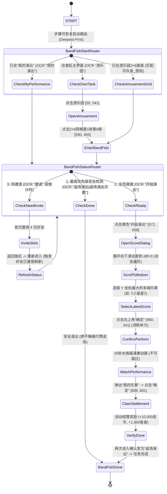

# 乐队鱼演出自动化 (docs/features/band-fish.md)

**最后更新**: 2026-09-05  
**状态**: Phase 1（导航与三大状态识别路由）与 Phase 2（4 位指定好友槽位邀请、防误触闭环与刷新状态机）全量实现完毕，并通过全套静态门禁与单元验证。

---

## 一、功能定位与背景

开心水族箱游乐园「乐队鱼演出」自动化功能（`BandFishTask`）。  
通过自动化流程进入乐队鱼演出界面，将 4 位预设好友按槽位邀请入队，凑齐 5 位音乐家后触发演出，动态选择最新乐谱并完成每日演出产出。

### 稀缺资源与核心约束
- **每日仅有 1 次演出体力**：点击最终的演出确认键会立即消耗体力，且全天无法重置，属于极度稀缺资源；
- **防误邀机制**：必须严格匹配 4 位指定好友，绝不能邀请错人，严禁触发付费“雇佣”；
- **真实页面原则**：基于每次实机的实时截屏与 OCR bbox 进行动作决策，严禁硬编码卡片行列或经验偏移；
- **防钻石误触**：演出结束后界面变为“12💎返场演出”，状态机必须优先检测“返场演出”并安全退出，严禁点击付费返场。

---

## 二、真实业务模型：5 个槽位与好友池映射

经过实机探索纠正，乐队鱼**并非**主界面上存在 4 个独立入口，而是在「我的演出」活动页面内设有 **5 个固定音乐家槽位**，每个待邀请槽位拥有独立的“邀请”按钮与专属好友池：

| 槽位编号 | 默认角色名 | 对应指定好友 | 对应槽位邀请按钮坐标 (近似) | 状态验证证据 |
| :--- | :--- | :--- | :--- | :--- |
| **槽位 1** | 詹姆斯 | **不想上课** | `[250, 399]` (中心 280, 415) | 邀请后槽位名替换为“不想上课” |
| **槽位 2** | 安妮 | **一只胖梨** | `[418, 455]` (中心 447, 470) | 搜索后唯一定位，邀请后显示 4h 倒计时 |
| **槽位 3** | 麦克 | *玩家自身主唱* | *无需邀请* | 玩家自身固定主角 |
| **槽位 4** | 皮亚佐拉 | **扶摇** | `[798, 451]` (中心 831, 468) | 好友列表首屏直接可见，邀请后进入倒计时 |
| **槽位 5** | 戴维斯 | **游来游去** | `[993, 403]` (中心 1023, 417) | 好友列表首屏直接可见，邀请后进入倒计时 |

---

## 三、完整状态机流转

---

## 四、好友精确选择与防误触算法（事故教训与规范）

### 1. 事故复盘与根因分析
在前期探索中，曾发生点击“不想上课”时误选了上一行“没事傻乐呵”的事故：
- **目标 bbox**: `[836, 442, 104, 27]`，中心 `(888, 455)`
- **误点击点**: `(888, 375)`，即 $\Delta Y = -80$
- **根本原因**: 人为推测“头像在文字上方约 80px”，盲目套用负向偏移，而卡片 1 底边位于 Y=370，导致点击落入上一行卡片的感应边缘。

### 2. 永久整改原则
1. **废除所有固定经验偏移**：严禁 `click_y = bbox.y - 80` 此类代码；
2. **文字中心即受击锚点**：直接使用 OCR 名字识别框的中心点作为点击坐标：
   $$\text{click\_x} = \text{bbox.x} + \frac{\text{bbox.w}}{2}, \quad \text{click\_y} = \text{bbox.y} + \frac{\text{bbox.h}}{2}$$
   实测 3 轮连续 Dry-run（点击 $\rightarrow$ 验证 $\rightarrow$ 取消），成功率 **100% (3/3)**，确定性极高；
3. **点击后闭环验证门禁**：
   点击后必须重新截屏并检测选中的卡片高亮差异；只有当确认 `selected_name == target_name` 时，才允许点击底部的全局“邀请”按钮 `[889, 648]` (中心 920, 666)。若不匹配，立即再次点击同位置取消并报警。

### 3. 2026-09-06 误邀真实好友严重业务事故复盘与目标好友强绑定规范 (重要)

#### 事故经过与定性
- **定性**: 严重业务事故。
- **现象**: 在重构 `BandFishInviteLoopAction` 动态邀请循环时，由于对“解耦硬编码”的错误过度推演，将“解耦硬编码坐标和死循环槽位”误当成“解耦好友姓名”，移除了目标好友姓名的强 OCR 校验，改为了“遍历首项卡片直接点击并确认”。在实机执行中，对槽位 4 和槽位 5 误向非预设的真实玩家好友（首项“圣黛”）发出了邀请。

#### 业务本质澄清
- **核心业务逻辑**: 4 位指定好友（`不想上课`、`一只胖梨`、`扶摇`、`游来游去`）是开心水族箱官方/脚本人机测试账号，具备**秒级接受**的绝对关键特性。这是整个乐队鱼自动化演出及 DailyRoutine Pass 2 能够在短时间内成功闭环的基石。
- **强硬编码是需求，而非缺陷**: 硬编码 4 位目标好友名字是明确的业务刚需；绝不可为了通用化而随意邀请真实好友。
- **需要避免的真实缺陷**:
  1. 硬编码屏幕点击绝对坐标；
  2. 假定目标好友永远在列表第 1 位；
  3. 未经名字匹配与确认即盲目点击确认邀请。

#### 闭环整改硬约束（纯列表 OCR 方案）
1. **严格恢复 4 大槽位目标好友映射**:
   - 槽位 1 -> `不想上课`
   - 槽位 2 -> `一只胖梨`
   - 槽位 4 -> `扶摇`
   - 槽位 5 -> `游来游去`
2. **好友选择执行纯列表 OCR 7 步标准流程**:
   - 打开好友选择页面；
   - 对当前页面进行 OCR；
   - 提取好友卡片名字；
   - 与 `BAND_FISH_TARGETS` 精确匹配；
   - 找到目标好友后点击对应卡片文字中心；
   - 验证选中状态（卡片选中且底部确认按钮变绿）；
   - 点击邀请。
3. **四项绝对禁止原则**:
   - ❌ **禁止点击列表第一项**；
   - ❌ **禁止使用搜索框寻找**（彻底废除搜索栏方案，避免输入法与状态污染）；
   - ❌ **禁止根据好友排序猜测**；
   - ❌ **禁止根据坐标固定绑定好友**；
   - 若遍历列表后未匹配到目标好友，立即触发安全熔断点击左上角退出，绝不误触任何其他好友！

---

## 五、状态刷新与就绪判定机制

1. **倒计时状态**：发出邀请后，对应槽位会替换为 4 小时有效倒计时（如 `03:59:38`）。
2. **刷新激活机制**：
   - 无需任何长等待（如 `sleep(300)`）；
   - **退出并重新进入活动页面即为系统刷新**：点击左上角“返回”退至鱼缸，再通过“游乐园 $\rightarrow$ 乐队鱼”重新进入；
   - 官方 Bot 好友在重新加载后会立即转为“已接受”状态，倒计时消失，槽位显示正式好友名。
3. **就绪判定节点（Ready）**：
   - 当 4 位好友全员接受后，页面底部中央将直接出现高亮的大型【开始演出】按钮；
   - **识别特征**: OCR `expected: "开始演出"`，bbox `[572, 608, 130, 45]`，中心 `(637, 630)`。

---

## 六、乐章选择弹窗与第二确认键

点击第一个【开始演出】按钮后，不会立即消耗体力，而是弹出乐章配置弹窗：
- **弹窗标题**: `[281, 340, 359, 35]` “请选择您要演奏的乐章”
- **当前可见乐章**:
  - `欢乐颂`: 文本 `[710, 450, 80, 33]`，单选按钮中心约 `(750, 468)`
  - `噜啦啦`: 文本 `[712, 595, 77, 29]`，单选按钮中心约 `(750, 614)`
- **真正消耗体力的第二确认键**:
  - 弹窗右上角的绿色【确定】按钮：`[990, 341, 67, 36]`，中心 `(1023, 359)`
  - **点击此按钮将正式开启演出并扣除今日唯一体力**。

---

## 七、Pass 2 演出闭环与调度机制实现 (2026-09-06)

在 Phase 2A 中已完成 Pass 2 核心演出动作 `BandFishPerformAction` 与调度闭环：
1. **就绪分支路由 (`BandFishCheckReady`)**：
   - OCR 检测到底部绿色【开始演出】按钮后，触发 `BandFishPerformAction`；
2. **演出动作 5 大职责分工与 4 阶段状态机 (`BandFishPerformAction`)**：
   - **职责 1: 开始演出**：点击“开始演出” `(637, 630)`；
   - **职责 2: 选曲确认**：动态等待选曲弹窗（“请选择您要演奏的乐章”），点击右上角绿色【确定】按钮 `(1023, 359)` 消耗体力开始演出；
   - **职责 3: 演出与跳过检测 (4 阶段状态机)**：
     - `PLAYING`：进入演出动画阶段；
     - `WAIT_SKIP_BUTTON`：在 6 秒前置探测窗口内调用 `check_band_fish_skip_button(f_cur)` 检测跳过按钮；
     - `CLICK_SKIP`：若检测到有效坐标则点击跳过，平滑转入结算等待；
     - `WAIT_RESULT`：若未检出跳过（当前默认返回 `None`）或已点击跳过，转入结算轮询等待；
   - **职责 4: 结算等待与领取**：检测“我的乐章”结算弹窗底部【确定】按钮 `(639, 680)` 或“返场演出”页面，点击领取结算奖励；
   - **职责 5: 状态沉淀**：标记 `band_fish_state["status"] = "DONE"` 与 `band_fish_state["performance_finished"] = True`；
3. **跳过按钮预留接口规范 (`check_band_fish_skip_button`)**：
   - `load_band_fish_skip_template()`: 加载 `assets/resource/image/乐队鱼_跳过.png`，不存在时安全返回 `None`；
   - `check_band_fish_skip_button(frame)`: 当前空实现安全返回 `None`，严禁猜测固定坐标或盲点，待未来采集样本后接入 OpenCV 模板匹配；
4. **日常收尾 Pass 2 调度闭环**：
   - 勾选乐队鱼时，`InitDailyRoutineAction` 在末尾追加 `"BAND_FISH_PASS2"`；
   - 排队流转：`BAND_FISH_PASS1 -> GOLDEN_DOLPHIN -> FISHING -> ROMANTIC_HOUSE -> BAND_FISH_PASS2 -> ALL_DONE`；
   - Pass 2 到达时：若状态为 `PENDING`，触发回访进入演出；若已为 `DONE`，直接跳过。

---

## 八、全流程归档证据截图索引

所有勘察证据全量保存在 `d:\happyfishgame\dev\exploration\band_fish\`：

| 截图文件名 | 说明 |
| :--- | :--- |
| `misclick_forensics_current.png` | 误点现场取证截图 |
| `misclick_marked.png` | 误点根因（卡片交界边界与点击点标记）分析图 |
| `dryrun1_selected.png` ~ `dryrun3_selected.png` | 3轮 Dry-run 精准选中校验图 |
| `formal_selected_buxiangshangke.png` | 正式选中“不想上课”卡片验证图 |
| `after_invite_performance.png` | 槽位 1 邀请成功后倒计时截图 |
| `slot2_search_yizhipangli_result.png` | 槽位 2 成功搜索并定位“一只胖梨”证据图 |
| `formal_selected_yizhipangli.png` | 槽位 2 正式选中“一只胖梨”图 |
| `formal_selected_fuyao.png` | 槽位 4 正式选中“扶摇”图 |
| `formal_selected_youlaiyouqu.png` | 槽位 5 正式选中“游来游去”图 |
| `after_all_four_invited_performance.png` | 全部 4 位好友邀请完成后的全槽位状态图 |
| `step4_reentered_performance.png` | 退出重进后全员就绪、激活“开始演出”按钮图 |
| `step5_score_selection_page.png` | 乐章选择弹窗与第二“确定”按钮全屏实机图 |
| `score_dialog_precise.png` | 乐章选择弹窗特写图 |
