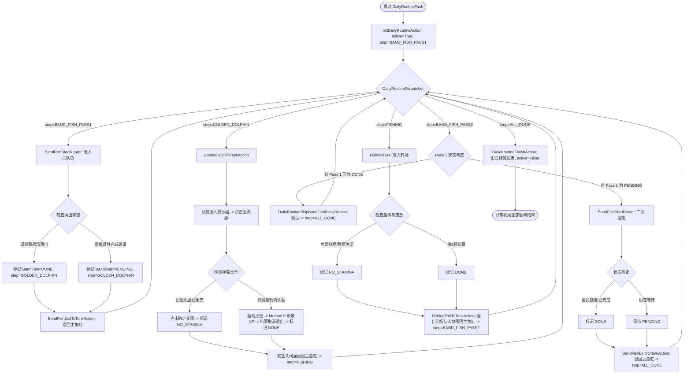

# 日常收尾总控任务 (docs/features/daily-routine.md)

**最后更新**: 2026-09-06  
**版本**: v1 (Pass 1 -> Dolphin -> Fishing -> Pass 2 -> All Done)  
**状态**: ✅ 已全量实现并通过 9 大离线单元测试与全部静态合规门禁。

---

## 一、功能定位与设计目标

随着开心水族箱活动功能的增多，每日均有多个有限次数、体力消耗、非阻塞邀请类的任务需要执行（如游乐园乐队鱼邀请、金海豚小游戏经验星收集、钓鱼达人每日垂钓）。  
以往各任务作为独立项运行，存在以下痛点：
1. **原地等待低效**：乐队鱼首轮邀请发出后，好友需要一定时间接受，若原地轮询等待极度浪费挂机时间；
2. **退出不归位**：各子任务执行完毕后停留在各自的二级页面或面板，无法直接衔接下一个任务；
3. **耗尽即报错**：鱼饵耗尽、体力耗尽或今日游戏机会用完时，传统流程易被判定为任务失败或抛出异常。

【日常收尾】(`DailyRoutineTask`) 专为每日固定刷新、有限次数任务提供统一有序编排与生命周期管理。

---

## 二、核心设计原则

1. **严格按序非阻塞串联 (DAG Flow)**：
   - 顺序：`BandFish Pass1` $\rightarrow$ `GoldenDolphin` $\rightarrow$ `Fishing` $\rightarrow$ `BandFish Pass2` $\rightarrow$ `AllDone`。
   - 乐队鱼首轮发完邀请后立即返回 `PENDING` 并安全退回鱼缸，转而执行海豚与钓鱼，充分利用中间时间等待好友接受，尾轮再回访判定，彻底消灭原地干等。
2. **终态安全契约 (Graceful Status Contract)**：
   - 次数耗尽 / 鱼饵用完 / 体力耗尽属于合法的业务终态（`NO_STAMINA`），绝不抛出异常，绝不阻塞总控流转。
3. **物理归位契约 (Clean Exit to Tank)**：
   - 每个子任务节点在结束时必须 100% 确保通过物理返回按键与浮层安全点击，完全退回到水族箱主界面（`主界面特征.png`）。
4. **单任务与总任务双模兼容 (Dual-mode Compatibility)**：
   - `DailyRoutineTask` 串联的各个任务（`BandFishTask`、`GoldenDolphinTask`、`FishingTask`）在 MFA UI 中依然保持独立可选，既可在日常收尾中由总控调度，也可以由用户单独勾选单任务调试运行。

---

## 三、完整状态机流转



---

## 四、核心模块与契约实现

### 1. 运行时状态管理 (`agent/runtime_state.py`)

- `daily_routine_state`:
  ```python
  daily_routine_state = {
      "active": False,
      "step": "INIT",  # "BAND_FISH_PASS1" | "GOLDEN_DOLPHIN" | "FISHING" | "BAND_FISH_PASS2" | "ALL_DONE"
      "tasks": {
          "BandFish": {"status": "IDLE", "stage": "PASS1"},
          "GoldenDolphin": {"status": "IDLE"},
          "Fishing": {"status": "IDLE"},
      },
  }
  ```
- `fishing_state`: 记录 `cast_count`、`max_casts` (5) 与 `status` (`DONE` / `NO_STAMINA`)。
- `golden_dolphin_state`: 记录 `status` (`DONE` / `NO_STAMINA`)。

### 2. 物理退出与状态沉淀 Action (`agent/my_action.py`)

- **`BandFishExitToTankAction`**:
  - 判定当前为 Pass 1 还是 Pass 2；
  - 若已完成演出，沉淀 `DONE`；若在等待，沉淀 `PENDING`；
  - 点击左上角返回 `(91, 46)` $\rightarrow$ 安全区 `(640, 150)` 关闭浮层，确保回到主鱼缸；
  - 自动推进步骤至 `GOLDEN_DOLPHIN` 或 `ALL_DONE`。
- **`FishingExitToTankAction`**:
  - 检查甩杆数是否达标：$\ge 5$ 为 `DONE`，否则为 `NO_STAMINA`；
  - 点击钓场返回 `(50, 45)` $\rightarrow$ 地点大地图关闭 `(1235, 45)` $\rightarrow$ 安全区 `(640, 150)`；
  - 推进步骤至 `BAND_FISH_PASS2`，并将乐队鱼阶段置为 `PASS2`。
- **`GoldenDolphinTaskAction`**:
  - 导航进入游乐园面板并点击金海豚图标；
  - 弹窗双模判定：
    - **特征 1 (色彩几何)**: "想玩小游戏"弹窗在绿色对号左侧伴随红色圆形取消叉叉 `(670, 449)`，而"机会耗尽"弹窗左侧无红色按钮；
    - **特征 2 (OCR 语义)**: 检测是否包含"用完"或"明天再来"；
  - 若已耗尽：点击确定关闭，记录 `NO_STAMINA`，推进至 `FISHING` 并安全退出；
  - 若可玩：点击确定，首次点击激活计时 (`GoldenDolphinWaitingStart`)，执行 Method E 收集 XP，匹配游戏结束取消按钮退出，记录 `DONE`。
- **`InitDailyRoutineAction` / `DailyRoutineSkipBandFishPass2Action` / `DailyRoutineFinishAction`**:
  - 分别负责状态重置、Pass 2 智能跳过以及执行完毕后的总汇总结算报告打印。

### 3. 条件路由 Recognition (`agent/my_reco.py`)

- **`CheckDailyRoutineStepReco`**:
  - 检查 `daily_routine_state["active"]`；若非活跃则直接返回 `None`（保障独立单任务不被误调）；
  - 匹配 `custom_recognition_param` 中的 `expected_step`，命中则返回 `(0, 0, 10, 10)`。
- **`CheckBandFishPass2NeededReco` / `CheckBandFishPass2SkipReco`**:
  - 根据 Pass 1 沉淀的状态进行二选一互斥分流：若为 `PENDING` 则进入二次回访，否则直接跳过。

---

## 五、验证与门禁标准

1. **离线单测套件**：`python dev/test_daily_routine_suite.py`（9 项全量测试 100% PASS）；
2. **流水线正则双层校验**：`python dev/test_pipeline_regex.py`（70 项正则无误，174 节点加载成功）；
3. **Pipeline 引用完整性**：`python dev/test_agent_registration_refs.py`（23 Actions / 17 Recos 注册完整）；
4. **自动更新契约**：`python dev/test_update_contract.py`（三份 interface.json 字节级一致，SemVer 0.4.5）；
5. **发布依赖冒烟**：`python dev/test_release_agent_imports.py`（embedded 环境依赖完整可导）。
