# 日常收尾总控任务 (docs/features/daily-routine.md)

**最后更新**: 2026-09-16
**版本**: v11（绿野寻仙踪日常：开贝壳一次 + 买一条贝币鱼）
**状态**: 已实现串行容器、自由多选组合、逐项日志、宝石订单、绿野寻仙踪日常及乐队鱼异步调度；已落地双出口路由消除独立运行超时失败。

---

## 一、功能定位与设计目标

开心水族箱小助手中存在多个每日固定执行的维护与活动任务：
- **每日免费礼包** (`DailyFreeGiftTask`)
- **驯鹿鱼送收礼物** (`ReindeerFishGiftTask`)
- **兑换金贝壳券** (`GoldShellCouponTask`)
- **绿野寻仙踪日常** (`GreenWildDailyTask`)
- **乐队鱼演出** (`BandFishTask`)
- **金海豚小游戏** (`GoldenDolphinTask`)
- **摇一摇小游戏** (`ShakeGameTask`)
- **钓鱼达人** (`FishingTask`)
- **宝石礼盒兑换** (`GemGiftBoxTask`)
- **宝石订单** (`GemOrderTask`)
- **浪漫满屋** (`RomanticHouseTask`)

在 Phase 2 中，【日常收尾】(`DailyRoutineTask`) 明确降级为确定性的**“串行任务容器”**：
1. **自由多选组合**：用户可在 MFAAvalonia 界面中按需自由勾选任意子任务组合；
2. **固定异步顺序**：勾选乐队鱼时，先执行乐队鱼 Pass 1 发出邀请，再执行每日免费礼包、驯鹿鱼送收礼物、兑换金贝壳券、绿野寻仙踪日常、金海豚、摇一摇、钓鱼达人、宝石礼盒兑换、宝石订单、浪漫满屋等其他已勾选任务，最后执行乐队鱼 Pass 2 回访演出；
3. **安全退出保障**：每个子任务执行结束（成功、次数用尽、体力不足等）后，必须 100% 返回主鱼缸珊瑚，方可推进下一任务；
4. **两阶段异步执行**：乐队鱼 Pass 1 / Pass 2 已接入调度；中间任务的执行时间用于等待人机好友接受邀请。

---

## 二、任务开关与参数传递契约 (PI V2)

### 1. 界面选项声明 (`interface.json`)
在 `interface.json` 的 `DailyRoutineTask` 下配置 `checkbox` 类型的任务选项 `日常收尾任务`：
- **类型**: `"type": "checkbox"`
- **默认值**: 保留原五项默认选择（乐队鱼、金海豚、摇一摇、钓鱼达人、浪漫满屋）；“每日免费礼包”、“驯鹿鱼送收礼物”、“兑换金贝壳券”、“绿野寻仙踪日常”、“宝石礼盒兑换”与“宝石订单”默认不勾选，由用户按需主动开启。
- **Cases 与 Pipeline Override**:
  每个 case 独立覆盖 pipeline 中的专有使能节点，互不冲突：
  - `每日免费礼包` → `DailyRoutineEnableFreeGift: { "enabled": true }`
  - `驯鹿鱼送收礼物` → `DailyRoutineEnableReindeerFish: { "enabled": true }`
  - `兑换金贝壳券` → `DailyRoutineEnableGoldShellCoupon: { "enabled": true }`
  - `绿野寻仙踪日常` → `DailyRoutineEnableGreenWildDaily: { "enabled": true }`
  - `乐队鱼` $\rightarrow$ `DailyRoutineEnableBandFish: { "enabled": true }`
  - `金海豚` $\rightarrow$ `DailyRoutineEnableGoldenDolphin: { "enabled": true }`
  - `摇一摇` $\rightarrow$ `DailyRoutineEnableShakeGame: { "enabled": true }`
  - `钓鱼达人` $\rightarrow$ `DailyRoutineEnableFishing: { "enabled": true }`
  - `宝石礼盒兑换` $\rightarrow$ `DailyRoutineEnableGemGiftBox: { "enabled": true }`
  - `宝石订单` $\rightarrow$ `DailyRoutineEnableGemOrder: { "enabled": true }`
  - `浪漫满屋` $\rightarrow$ `DailyRoutineEnableRomanticHouse: { "enabled": true }`

### 2. 独立调试入口管理
- **浪漫满屋 (`RomanticHouseTask`)**：因功能已全面测试完毕并达成 100% 闭环，从三份 `interface.json` 的任务列表中移除独立入口，统一通过日常收尾入口运行；
- **保留独立入口**：`BandFishTask`、`GoldenDolphinTask`、`ShakeGameTask`、`FishingTask`、`GemGiftBoxTask`、`GemOrderTask`、`GoldShellCouponTask` 保留在 `interface.json` 中，供后续专项调试使用。
- **共享子任务参数**：`DailyRoutineTask` 同时显示“乐队鱼乐章”“金海豚奖励优先级”“钓鱼地点”和“钓鱼饵食适配模式”；金海豚可选择四类最高优先级，钓鱼普通模式固定 5 杆，美味模式不限杆数并由用户手动停止。

---

## 三、调度器与状态机架构

```mermaid
flowchart TD
    Start([启动 DailyRoutineTask]) --> Init[InitDailyRoutineAction: 解析勾选项并组装 queue]
    Init --> InitLog[DailyRoutineInitLog: 显示已选与未勾选跳过项]
    InitLog --> Dispatcher{DailyRoutineDispatcher}

    %% 步骤分发
    Dispatcher -- step=FREE_GIFT --> FG[DailyFreeGiftTask: 每日免费礼包]
    Dispatcher -- step=REINDEER_FISH --> RF[ReindeerFishGiftTask: 驯鹿鱼送收礼物]
    Dispatcher -- step=GOLD_SHELL_COUPON --> GSC[GoldShellCouponTask: 兑换金贝壳券]
    Dispatcher -- step=GREEN_WILD_DAILY --> GWD[GreenWildDailyTask: 开贝壳一次后买一条贝币鱼]
    Dispatcher -- step=BAND_FISH_PASS1 --> BF[BandFishStartRouter: 乐队鱼]
    Dispatcher -- step=GOLDEN_DOLPHIN --> GD[GoldenDolphinTask: 金海豚]
    Dispatcher -- step=SHAKE_GAME --> SG[ShakeGameTask: 摇一摇]
    Dispatcher -- step=FISHING --> FI[FishingDailyTask: 普通饵食、固定 5 杆]
    Dispatcher -- step=GEM_GIFT_BOX --> GGB[GemGiftBoxTask: 宝石礼盒兑换七配方]
    Dispatcher -- step=GEM_ORDER --> GO[GemOrderTask: 宝石订单]
    Dispatcher -- step=ROMANTIC_HOUSE --> RH[RomanticHouseStartRouter: 浪漫满屋]
    Dispatcher -- step=ALL_DONE --> Finish[DailyRoutineFinishAction: 汇总报告并结束]

    %% 退出与队列推进
    FG --> FG_Exit[识别回到鱼缸 -> DailyFreeGiftDoneAction]
    RF --> RF_Exit[识别回到鱼缸 -> ReindeerFishDoneAction]
    GSC --> GSC_Exit[GoldShellCouponVerifyTank: 回主鱼缸 -> GoldShellCouponDoneAction]
    GWD --> GWD_Exit[GreenWildDailyVerifyTank: 回主鱼缸 -> GreenWildDailyDoneAction]
    BF --> BF_Exit[BandFishExitToTankAction: 回主鱼缸 -> advance_daily_routine_step]
    GD --> GD_Exit[最多连续三局；无次数或三局完成 -> advance_daily_routine_step]
    SG --> SG_Exit[最多连续三局；无次数或三局完成 -> advance_daily_routine_step]
    FI --> FI_Exit[FishingExitToTankAction: 回主鱼缸 -> advance_daily_routine_step]
    GGB --> GGB_Exit[GemGiftBoxVerifyTank: 回主鱼缸 -> GemGiftBoxDoneAction]
    GO --> GO_Exit[GemOrderVerifyTank: 回主鱼缸 -> GemOrderDoneAction]
    RH --> RH_Exit[RomanticHouseExitToTankAction: 珊瑚回主鱼缸 -> advance_daily_routine_step]

    FG_Exit --> Dispatcher
    RF_Exit --> Dispatcher
    GSC_Exit --> Dispatcher
    GWD_Exit --> Dispatcher
    BF_Exit --> Dispatcher
    GD_Exit --> Dispatcher
    SG_Exit --> Dispatcher
    FI_Exit --> Dispatcher
    GGB_Exit --> Dispatcher
    GO_Exit --> Dispatcher
    RH_Exit --> Dispatcher

    %% 保留的两阶段拓扑 (Pass 2)
    Dispatcher -. step=BAND_FISH_PASS2 (保留) .-> P2[DailyRoutineStepBandFishPass2]
    P2 -.-> P2_Skip[CheckSkip -> SkipAction]
    P2 -.-> P2_Run[CheckNeeded -> BandFishStartRouter]
```



---

## 四、核心模块实现

### 1. 运行时状态管理 (`agent/runtime_state.py`)
- `daily_routine_state`:
  ```python
  daily_routine_state = {
      "active": False,
      "step": "INIT",
      "queue": [],  # 待执行的后续子任务序列
      "tasks": {
          "FreeGift": {"status": "IDLE"},
          "ReindeerFish": {"status": "IDLE"},
          "GoldShellCoupon": {"status": "IDLE"},
          "BandFish": {"status": "IDLE", "stage": "PASS1"},
          "GoldenDolphin": {"status": "IDLE"},
          "ShakeGame": {"status": "IDLE"},
          "Fishing": {"status": "IDLE"},
          "GemGiftBox": {"status": "IDLE"},
          "GemOrder": {"status": "IDLE"},
          "RomanticHouse": {"status": "IDLE"},
      },
  }
  ```

### 2. 队列推进逻辑 (`agent/my_action.py`)
- **`advance_daily_routine_step(task_name, biz_status)`**:
  - 记录子任务状态（`DONE` / `NO_STAMINA` / `PENDING`）；
  - 若 `queue` 尚有任务，弹出首项赋给 `step`；
  - 若 `queue` 已空，置 `step = "ALL_DONE"`；
- **`InitDailyRoutineAction`**:
  - 优先解析 `custom_action_param`（支持单元测试与直接调用）；
  - 否则通过 `context.get_node_data()` 读取 10 个 `DailyRoutineEnable*` 节点的 `enabled` 状态；
  - 按固定顺序组装待执行队列（`BAND_FISH_PASS1` $\rightarrow$ `FREE_GIFT` $\rightarrow$ `REINDEER_FISH` $\rightarrow$ `GOLD_SHELL_COUPON` $\rightarrow$ `GOLDEN_DOLPHIN` $\rightarrow$ `SHAKE_GAME` $\rightarrow$ `FISHING` $\rightarrow$ `GEM_GIFT_BOX` $\rightarrow$ `GEM_ORDER` $\rightarrow$ `ROMANTIC_HOUSE` $\rightarrow$ `BAND_FISH_PASS2`），无勾选时直接跳过至 `ALL_DONE`；
  - 初始化后通过 `DailyRoutineInitLog` 在 MFA 日志展示“已选择”和“因未勾选跳过”摘要；每个 `DailyRoutineStep*` 在真正分发前显示“开始执行”，避免摇一摇等任务看起来被静默跳过。
- **`GoldShellCouponDoneAction`**:
  - 主鱼缸验证成功后调用 `advance_daily_routine_step("GoldShellCoupon", "DONE")`，推进流水线经双出口路由返回 `DailyRoutineDispatcher`。
- **`GemGiftBoxDoneAction`**:
  - 主鱼缸验证成功后调用 `advance_daily_routine_step("GemGiftBox", "DONE")`，推进流水线经双出口路由返回 `DailyRoutineDispatcher`。
- **`GemOrderDoneAction`**:
  - 主鱼缸验证成功后调用 `advance_daily_routine_step("GemOrder", "DONE")`；日常模式继续队列，独立模式正常结束。
- **`RomanticHouseExitToTankAction`**:
  - 标记 `RomanticHouse` 状态为 `DONE`，调用 `advance_daily_routine_step`，推进流水线回到 `DailyRoutineDispatcher`。

### 3. 子任务物理归位保障
| 子任务 | 退出触发点 | 返回主鱼缸实现 |
| --- | --- | --- |
| **每日免费礼包** | 领取成功或识别到已售罄 | OCR 点击充值页左上角“返回”，模板确认鱼缸后推进队列 |
| **驯鹿鱼送收礼物** | 一键收取，或一键回礼后直接返回/直接赠送 | OCR 点击通用返回，模板确认鱼缸后推进队列 |
| **兑换金贝壳券** | 完成兑换或复核未识别到兑换按钮 | 状态驱动两级返回：金贝壳主页返回 $\rightarrow$ 模板确认退回分类页 $\rightarrow$ 分类页返回 $\rightarrow$ 模板确认回到主鱼缸，触发 `GoldShellCouponDoneAction` |
| **乐队鱼** | 邀请完成或无空位 | `BandFishExitToTankAction`：点击左上角返回 `(91, 46)` + 保底关闭面板 `(640, 150)` |
| **金海豚** | 按用户选择的最高优先级全屏处理四类奖励；每局结束后未满 3 局则重进；第 3 局完成或机会耗尽 | `GoldenDolphinExitAction` 等待结算模板、点击实际命中位置，并以主界面模板确认物理归位后才记录局数；`NO_STAMINA` 关闭提示并完成同一归位门禁后才推进队列 |
| **摇一摇** | 每局结束后未满 3 局则重进；第 3 局完成或次数耗尽 | `ShakeGameExitAction` 记录局数并重进；`NO_STAMINA` 正常推进队列；退出后接入双出口路由 |
| **钓鱼达人** | 普通模式由 `FishingDailyTask` 重选黄色奶酪并固定 5 杆；美味模式由 `FishingDailySpecialTask` 沿用手选鱼饵、不限杆数、手动停止 | 依次识别点击钓场与地点页右上角退出；以 `主界面特征.png` 确认回缸后才由 `FishingDoneAction` 推进队列 |
| **宝石礼盒兑换** | 7 个等级配方巡检并兑换/跳过完毕 | `GemGiftBoxVerifyTank` 命中 `主界面特征.png` 后触发 `GemGiftBoxDoneAction` 推进队列并接入双出口路由 |
| **宝石订单** | 达到 10/10；可完成订单点完成，不可完成订单双确认丢弃 | `GemOrderVerifyTank` 命中 `主界面特征.png` 后触发 `GemOrderDoneAction`，接入日常/独立双出口 |
| **浪漫满屋** | 10次点赞完成或已满 | 双级心形关闭 `(1197, 57)` + 状态验证回主鱼缸珊瑚 + `RomanticHouseExitToTankAction` |

### 4. 独立运行与日常收尾双出口路由架构 (Dual-Exit Routing Contract)

开心水族箱存在多个既可作为**独立任务**单独勾选运行，又可作为**日常收尾子任务**串行调度的功能（如摇一摇、金海豚、钓鱼达人、宝石礼盒兑换等）。

#### 根因与设计原则
- **问题根因**：若各子任务在返回主鱼缸确认后，终态节点硬编码指向 `DailyRoutineDispatcher`，在独立运行模式下（`daily_routine_state["active"] == False`），进入 Dispatcher 后的所有 Step 判定条件均不满足，MaaFramework 持续重试 20 秒超时后触发 `NextList.Failed`，最终在 UI 判定为任务运行失败；
- **禁止语义伪装**：严禁在 `CheckDailyRoutineStepReco` 中通过“若未激活则命中 ALL_DONE”来压制错误，因为“日常未激活”绝不等于“日常任务全部完成”，此种做法会混淆业务语义并导致虚假执行报告；
- **双出口分流规范**：所有子任务终态节点统一接入共享双出口路由：

```text
子任务终态节点 (如 ShakeGameVerifyTank / GoldenDolphinDone / GemGiftBoxVerifyTank)
                     │
                     ▼
        ┌────────────────────────────┐
        │  next:                     │
        │  DailyRoutineReturnIfActive│
        │  DailyRoutineStandaloneDone│
        └──────────────┬─────────────┘
                       │
         ┌─────────────┴─────────────┐
         ▼                           ▼
DailyRoutineReturnIfActive   DailyRoutineStandaloneDone
(CheckDailyRoutineActiveReco)  (DirectHit -> DoNothing 叶子节点)
         │                           │
         ▼ (active == True)          ▼ (active == False)
DailyRoutineDispatcher        任务成功正常退出 (ret=true)
```

- **静态契约门禁**：`dev/test_daily_routine_scheduler.py` 中的 `test_architecture_contract_no_hardcoded_dispatcher` 确保所有日常子任务终态节点均接入双出口路由，严禁任何子任务直接硬编码指向 `DailyRoutineDispatcher`。

### 每日免费礼包分支契约

入口模板 `充值页面入口.png` 由用户手动裁剪，裁剪范围为 `[505,33,40,32]`，Pipeline 使用扩展搜索范围 `[455,0,140,115]`。

```text
鱼缸 -> 模板点击充值入口 -> OCR 点击“超值礼包”
                         ├─ OCR“免费领取” -> 点击 -> OCR 点击弹窗“返回” ┐
                         └─ OCR“售罄”（兼容“已售罄”）----------------┤
                                                                    -> OCR 点击左上角“返回” -> 模板确认鱼缸
```

领取成功后直接退出，不再检查“已售罄”。任务也支持从领取成功弹窗、已售罄页、可领取页或充值页恢复；重复执行时，“已售罄”是正常完成分支，不记为错误。实机 OCR 可能省略首字而只返回“售罄”，因此该分支使用稳定子串“售罄”匹配两种结果，并保持在“免费领取”分支之前，避免灰色禁用按钮造成误判。

#### 实机测试状态（2026-09-08）

| 分支 | MFA 实机状态 | 已确认范围 / 待验证范围 |
| --- | --- | --- |
| 礼包已领取（“售罄”分支） | **已通过** | 已确认能够识别“售罄/已售罄”、点击左上角“返回”并正常结束，不会把重复执行视为错误。 |
| 礼包可领取（“免费领取”分支） | **已通过** | 已确认能够识别并点击“免费领取” → 识别并点击领取成功弹窗中的“返回” → 点击充值页左上角“返回” → 确认回到鱼缸。 |

上述两条分支均已由用户在 MFA 中完成实机测试；每日免费礼包现已具备可领取与重复执行已售罄两条完整闭环。

### 驯鹿鱼送收礼物分支契约

驯鹿鱼是默认关闭的日常子任务。已接入“一键收取”和“一键回礼”两种页面分支；回礼后若全屏 OCR 识别到“直接赠送”则点击，否则直接识别左上角通用返回。详细节点、ROI 和未测试边界见 `docs/features/reindeer-fish.md`。

**实机状态：部分测试。** 已确认能够进入单按钮布局的“一键收取”页面与双按钮布局的“一键回礼”页面；二者是并列分支，不是 ROI 替换关系。2026-09-15 已根据现场日志把共享回礼节点改为在 `[537,611,128,44]` 识别稳定子串“键回礼”并点击，代码级验证完成；点击后的直接赠送/返回链仍待 MFA 复测。

---

## 五、验证与测试

运行调度器全场景测试套件：
```powershell
python dev/test_daily_routine_scheduler.py
```
覆盖用例：
1. **组合 1（全选）**: 乐队鱼 Pass 1 $\rightarrow$ 每日免费礼包 $\rightarrow$ 驯鹿鱼送收礼物 $\rightarrow$ 兑换金贝壳券 $\rightarrow$ 金海豚 $\rightarrow$ 摇一摇 $\rightarrow$ 钓鱼达人 $\rightarrow$ 宝石礼盒兑换 $\rightarrow$ 宝石订单 $\rightarrow$ 浪漫满屋 $\rightarrow$ 乐队鱼 Pass 2 $\rightarrow$ ALL_DONE
2. **组合 2（仅浪漫满屋）**: 浪漫满屋 $\rightarrow$ ALL_DONE
3. **仅每日免费礼包**: FREE_GIFT $\rightarrow$ ALL_DONE
4. **仅驯鹿鱼送收礼物**: REINDEER_FISH $\rightarrow$ ALL_DONE
5. **组合 3（仅金海豚）**: 金海豚 $\rightarrow$ ALL_DONE
6. **组合 4（浪漫满屋 + 钓鱼达人）**: 钓鱼达人 $\rightarrow$ 浪漫满屋 $\rightarrow$ ALL_DONE
7. **组合 5（空勾选）**: 直接跳过 $\rightarrow$ ALL_DONE
8. **组合 6（仅乐队鱼）**: Pass 1 $\rightarrow$ Pass 2 $\rightarrow$ ALL_DONE
9. **组合 7（仅宝石礼盒兑换）**: GEM_GIFT_BOX $\rightarrow$ ALL_DONE
10. **Pipeline 拓扑与分支检查**: 校验 10 个 Enable 节点、11 个 Dispatcher 候选（含 `GEM_GIFT_BOX` 与 `GEM_ORDER`），以及每日礼包、驯鹿鱼、宝石礼盒、宝石订单的分支契约
11. **UI Pipeline Override 节点读取与契约测试**: 模拟 MFA 传入 override 的完整流转，覆盖 6 种日常收尾勾选 cases
12. **独立执行保护**: `active=False` 时各子任务退出互不影响（`GemGiftBoxVerifyTank` 双出口分流至 `DailyRoutineStandaloneDone`）
13. **乐队鱼运行模式分流**: 日常模式返回调度器；独立待接受状态退出重进；独立完成状态正常结束
14. **金海豚连续执行**: 两次 `NEXT_ROUND` 后第 3 局 `DONE`；任意入口 `NO_STAMINA` 均正常推进下一任务
15. **钓鱼耗尽兼容**: 精确模板与 ROI 在开始、选饵、等待结算和循环阶段均优先识别；命中后复用右上角退出和主鱼缸确认链
16. **金海豚跨任务归位门禁**: 结算页出现较晚时等待取消模板并确认返回主鱼缸；未通过门禁不得推进到摇一摇等后续任务
17. **可见流转日志**: 初始化摘要包含所有已选与未勾选项；每个 Dispatcher 步骤在进入具体子任务前输出开始日志。

#### 乐队鱼异步实机测试状态（2026-09-08）

| 路径 | MFA 实机状态 | 已确认范围 / 待验证范围 |
| --- | --- | --- |
| 独立任务邀请 | **部分通过** | 已确认四位指定人机好友均能成功邀请并退出；旧流程随后误入未激活的日常调度器，本次已完成代码修复。 |
| 最新乐章定位 | **已通过** | 已确认能够自动下滑到列表底部并定位最末乐曲；这不等同于完整演奏通过。 |
| 体力耗尽退出 | **已通过** | 已确认体力用完时能够正常退出，不报错、不触发付费返场。 |
| 体力可用的完整演奏 | **尚未测试** | 待验证确认消耗体力、演奏、跳过按钮和结算领取的完整流程。 |
| 独立任务完整闭环 | **尚待复测** | 待验证单次运行内自动完成“邀请 → 退出 → 识别游乐园 → 识别乐队鱼入口 → 确认就绪 → 演出”。 |
| 日常收尾异步闭环 | **尚未测试** | 待验证 Pass 1 最先邀请、其他子任务继续执行、Pass 2 最后回访并演出。 |
