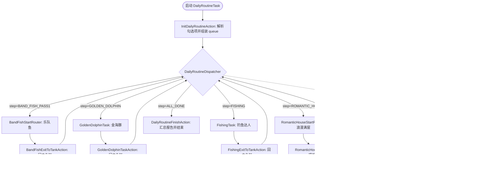

# 日常收尾总控任务 (docs/features/daily-routine.md)

**最后更新**: 2026-09-06  
**版本**: v2 (串行容器聚合与自由多选组合)
**状态**: ✅ 已全量实现并通过 9 项调度器自动化测试与全部静态合规门禁。

---

## 一、功能定位与设计目标

开心水族箱小助手中存在多个每日固定执行的维护与活动任务：
- **乐队鱼演出** (`BandFishTask`)
- **金海豚小游戏** (`GoldenDolphinTask`)
- **钓鱼达人** (`FishingTask`)
- **浪漫满屋** (`RomanticHouseTask`)

在 Phase 2 中，【日常收尾】(`DailyRoutineTask`) 明确降级为确定性的**“串行任务容器”**：
1. **自由多选组合**：用户可在 MFAAvalonia 界面中按需自由勾选任意子任务组合；
2. **固定安全顺序**：按 `1. 乐队鱼 -> 2. 金海豚 -> 3. 钓鱼达人 -> 4. 浪漫满屋` 严格有序串行推进；
3. **安全退出保障**：每个子任务执行结束（成功、次数用尽、体力不足等）后，必须 100% 返回主鱼缸珊瑚，方可推进下一任务；
4. **两阶段资产保留**：完整保留乐队鱼 Pass 1 / Pass 2 异步复验相关拓扑节点与 Action/Reco 实现，待后续乐队鱼功能进一步打磨完备后可直接无缝激活。

---

## 二、任务开关与参数传递契约 (PI V2)

### 1. 界面选项声明 (`interface.json`)
在 `interface.json` 的 `DailyRoutineTask` 下配置 `checkbox` 类型的任务选项 `日常收尾任务`：
- **类型**: `"type": "checkbox"`
- **默认值**: 默认全选 `["乐队鱼", "金海豚", "钓鱼达人", "浪漫满屋"]`
- **Cases 与 Pipeline Override**:
  每个 case 独立覆盖 pipeline 中的专有使能节点，互不冲突：
  - `乐队鱼` $\rightarrow$ `DailyRoutineEnableBandFish: { "enabled": true }`
  - `金海豚` $\rightarrow$ `DailyRoutineEnableGoldenDolphin: { "enabled": true }`
  - `钓鱼达人` $\rightarrow$ `DailyRoutineEnableFishing: { "enabled": true }`
  - `浪漫满屋` $\rightarrow$ `DailyRoutineEnableRomanticHouse: { "enabled": true }`

### 2. 独立调试入口管理
- **浪漫满屋 (`RomanticHouseTask`)**：因功能已全面测试完毕并达成 100% 闭环，从三份 `interface.json` 的任务列表中移除独立入口，统一通过日常收尾入口运行；
- **保留独立入口**：`BandFishTask`、`GoldenDolphinTask`、`FishingTask` 保留在 `interface.json` 中，供后续专项调试使用。

---

## 三、调度器与状态机架构



---

## 四、核心模块实现

### 1. 运行时状态管理 (`agent/runtime_state.py`)
- `daily_routine_state`:
  ```python
  daily_routine_state = {
      "active": False,
      "step": "INIT",
      "queue": [],  # 待执行的后续子任务序列
      "tasks": {
          "BandFish": {"status": "IDLE", "stage": "PASS1"},
          "GoldenDolphin": {"status": "IDLE"},
          "Fishing": {"status": "IDLE"},
          "RomanticHouse": {"status": "IDLE"},
      },
  }
  ```

### 2. 队列推进逻辑 (`agent/my_action.py`)
- **`advance_daily_routine_step(task_name, biz_status)`**:
  - 记录子任务状态（`DONE` / `NO_STAMINA` / `PENDING`）；
  - 若 `queue` 尚有任务，弹出首项赋给 `step`；
  - 若 `queue` 已空，置 `step = "ALL_DONE"`；
- **`InitDailyRoutineAction`**:
  - 优先解析 `custom_action_param`（支持单元测试与直接调用）；
  - 否则通过 `context.get_node_data()` 读取 4 个 `DailyRoutineEnable*` 节点的 `enabled` 状态；
  - 按固定顺序组装待执行队列，无勾选时直接跳过至 `ALL_DONE`；
- **`RomanticHouseExitToTankAction`**:
  - 标记 `RomanticHouse` 状态为 `DONE`，调用 `advance_daily_routine_step`，推进流水线回到 `DailyRoutineDispatcher`。

### 3. 子任务物理归位保障
| 子任务 | 退出触发点 | 返回主鱼缸实现 |
| --- | --- | --- |
| **乐队鱼** | 邀请完成或无空位 | `BandFishExitToTankAction`：点击左上角返回 `(91, 46)` + 保底关闭面板 `(640, 150)` |
| **金海豚** | 游戏结束/超时/机会耗尽 | `GoldenDolphinTaskAction`：点击退出 `(850, 574)` 或确认 `(btn_cx, btn_cy)` + 保底关闭面板 `(640, 150)` |
| **钓鱼达人** | 5杆完成或鱼饵耗尽 | `FishingExitToTankAction`：钓场返回 `(50, 45)` + 地图关闭 `(1235, 45)` + 关闭面板 `(640, 150)` |
| **浪漫满屋** | 10次点赞完成或已满 | 双级心形关闭 `(1197, 57)` + 状态验证回主鱼缸珊瑚 + `RomanticHouseExitToTankAction` |

---

## 五、验证与测试

运行调度器全场景测试套件：
```powershell
python dev/test_daily_routine_scheduler.py
```
覆盖用例：
1. **组合 1（全选）**: 乐队鱼 $\rightarrow$ 金海豚 $\rightarrow$ 钓鱼达人 $\rightarrow$ 浪漫满屋 $\rightarrow$ ALL_DONE
2. **组合 2（仅浪漫满屋）**: 浪漫满屋 $\rightarrow$ ALL_DONE
3. **组合 3（仅金海豚）**: 金海豚 $\rightarrow$ ALL_DONE
4. **组合 4（浪漫满屋 + 钓鱼达人）**: 钓鱼达人 $\rightarrow$ 浪漫满屋 $\rightarrow$ ALL_DONE
5. **组合 5（空勾选）**: 直接跳过 $\rightarrow$ ALL_DONE
6. **组合 6（仅乐队鱼）**: Pass 1 $\rightarrow$ Pass 2 $\rightarrow$ ALL_DONE
7. **Pipeline 拓扑与候选检查**: 100% 校验 4 个 Enable 节点与 6 个 Dispatcher 候选节点
8. **UI Pipeline Override 节点读取**: 模拟 MFA 传入 override 的完整流转
9. **独立执行保护**: `active=False` 时各子任务退出互不影响
