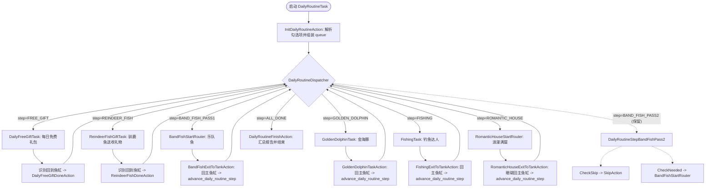

# 日常收尾总控任务 (docs/features/daily-routine.md)

**最后更新**: 2026-09-08
**版本**: v5 (新增驯鹿鱼送收礼物子任务)
**状态**: 已实现串行容器、自由多选组合与乐队鱼异步调度；相关实机边界详见“实机测试状态”。

---

## 一、功能定位与设计目标

开心水族箱小助手中存在多个每日固定执行的维护与活动任务：
- **每日免费礼包** (`DailyFreeGiftTask`)
- **驯鹿鱼送收礼物** (`ReindeerFishGiftTask`)
- **乐队鱼演出** (`BandFishTask`)
- **金海豚小游戏** (`GoldenDolphinTask`)
- **钓鱼达人** (`FishingTask`)
- **浪漫满屋** (`RomanticHouseTask`)

在 Phase 2 中，【日常收尾】(`DailyRoutineTask`) 明确降级为确定性的**“串行任务容器”**：
1. **自由多选组合**：用户可在 MFAAvalonia 界面中按需自由勾选任意子任务组合；
2. **固定异步顺序**：勾选乐队鱼时，先执行乐队鱼 Pass 1 发出邀请，再执行每日免费礼包、驯鹿鱼送收礼物、金海豚、钓鱼达人、浪漫满屋等其他已勾选任务，最后执行乐队鱼 Pass 2 回访演出；
3. **安全退出保障**：每个子任务执行结束（成功、次数用尽、体力不足等）后，必须 100% 返回主鱼缸珊瑚，方可推进下一任务；
4. **两阶段异步执行**：乐队鱼 Pass 1 / Pass 2 已接入调度；中间任务的执行时间用于等待人机好友接受邀请。

---

## 二、任务开关与参数传递契约 (PI V2)

### 1. 界面选项声明 (`interface.json`)
在 `interface.json` 的 `DailyRoutineTask` 下配置 `checkbox` 类型的任务选项 `日常收尾任务`：
- **类型**: `"type": "checkbox"`
- **默认值**: 保留原四项默认选择；新增“每日免费礼包”和“驯鹿鱼送收礼物”默认不勾选，由用户主动开启。
- **Cases 与 Pipeline Override**:
  每个 case 独立覆盖 pipeline 中的专有使能节点，互不冲突：
  - `每日免费礼包` → `DailyRoutineEnableFreeGift: { "enabled": true }`
  - `驯鹿鱼送收礼物` → `DailyRoutineEnableReindeerFish: { "enabled": true }`
  - `乐队鱼` $\rightarrow$ `DailyRoutineEnableBandFish: { "enabled": true }`
  - `金海豚` $\rightarrow$ `DailyRoutineEnableGoldenDolphin: { "enabled": true }`
  - `钓鱼达人` $\rightarrow$ `DailyRoutineEnableFishing: { "enabled": true }`
  - `浪漫满屋` $\rightarrow$ `DailyRoutineEnableRomanticHouse: { "enabled": true }`

### 2. 独立调试入口管理
- **浪漫满屋 (`RomanticHouseTask`)**：因功能已全面测试完毕并达成 100% 闭环，从三份 `interface.json` 的任务列表中移除独立入口，统一通过日常收尾入口运行；
- **保留独立入口**：`BandFishTask`、`GoldenDolphinTask`、`FishingTask` 保留在 `interface.json` 中，供后续专项调试使用。
- **共享子任务参数**：`DailyRoutineTask` 同时显示“乐队鱼乐章”和“钓鱼地点”；勾选钓鱼达人时，日常收尾会沿用与独立 `FishingTask` 相同的六地点 Pipeline Override。

---

## 三、调度器与状态机架构



---

## 四、核心模块实现

### 1. 运行时状态管理 (`agent/runtime_state.py`)
- `daily_routine_state`:
  ```python
  daily_routine_state = {
      "active": False,
      "step": "INIT",
      "queue": [],  # 待执行的后续子任务序列
      "tasks": {
          "FreeGift": {"status": "IDLE"},
          "ReindeerFish": {"status": "IDLE"},
          "BandFish": {"status": "IDLE", "stage": "PASS1"},
          "GoldenDolphin": {"status": "IDLE"},
          "Fishing": {"status": "IDLE"},
          "RomanticHouse": {"status": "IDLE"},
      },
  }
  ```

### 2. 队列推进逻辑 (`agent/my_action.py`)
- **`advance_daily_routine_step(task_name, biz_status)`**:
  - 记录子任务状态（`DONE` / `NO_STAMINA` / `PENDING`）；
  - 若 `queue` 尚有任务，弹出首项赋给 `step`；
  - 若 `queue` 已空，置 `step = "ALL_DONE"`；
- **`InitDailyRoutineAction`**:
  - 优先解析 `custom_action_param`（支持单元测试与直接调用）；
  - 否则通过 `context.get_node_data()` 读取 6 个 `DailyRoutineEnable*` 节点的 `enabled` 状态；
  - 按固定顺序组装待执行队列，无勾选时直接跳过至 `ALL_DONE`；
- **`RomanticHouseExitToTankAction`**:
  - 标记 `RomanticHouse` 状态为 `DONE`，调用 `advance_daily_routine_step`，推进流水线回到 `DailyRoutineDispatcher`。

### 3. 子任务物理归位保障
| 子任务 | 退出触发点 | 返回主鱼缸实现 |
| --- | --- | --- |
| **每日免费礼包** | 领取成功或识别到已售罄 | OCR 点击充值页左上角“返回”，模板确认鱼缸后推进队列 |
| **驯鹿鱼送收礼物** | 一键收取，或一键回礼后直接返回/直接赠送 | OCR 点击通用返回，模板确认鱼缸后推进队列 |
| **乐队鱼** | 邀请完成或无空位 | `BandFishExitToTankAction`：点击左上角返回 `(91, 46)` + 保底关闭面板 `(640, 150)` |
| **金海豚** | 游戏结束/超时/机会耗尽 | `GoldenDolphinTaskAction`：点击退出 `(850, 574)` 或确认 `(btn_cx, btn_cy)` + 保底关闭面板 `(640, 150)` |
| **钓鱼达人** | 5杆完成或鱼饵耗尽 | `FishingExitToTankAction`：钓场返回 `(50, 45)` + 地图关闭 `(1235, 45)` + 关闭面板 `(640, 150)` |
| **浪漫满屋** | 10次点赞完成或已满 | 双级心形关闭 `(1197, 57)` + 状态验证回主鱼缸珊瑚 + `RomanticHouseExitToTankAction` |

### 每日免费礼包分支契约

入口模板 `充值页面入口.png` 由用户手动裁剪，裁剪范围为 `[505,33,40,32]`，Pipeline 使用扩展搜索范围 `[455,0,140,115]`。

```text
鱼缸 -> 模板点击充值入口 -> OCR 点击“超值礼包”
                         ├─ OCR“免费领取” -> 点击 -> OCR 点击弹窗“返回” ┐
                         └─ OCR“售罄”（兼容“已售罄”）----------------┤
                                                                    -> OCR 点击左上角“返回” -> 模板确认鱼缸
```

领取成功后直接退出，不再检查“已售罄”。任务也支持从领取成功弹窗、已售罄页、可领取页或充值页恢复；重复执行时，“已售罄”是正常完成分支，不记为错误。实机 OCR 可能省略首字而只返回“售罄”，因此该分支使用稳定子串“售罄”匹配两种结果，并保持在“免费领取”分支之前，避免灰色禁用按钮造成误判。

#### 实机测试状态（2026-09-08）

| 分支 | MFA 实机状态 | 已确认范围 / 待验证范围 |
| --- | --- | --- |
| 礼包已领取（“售罄”分支） | **已通过** | 已确认能够识别“售罄/已售罄”、点击左上角“返回”并正常结束，不会把重复执行视为错误。 |
| 礼包可领取（“免费领取”分支） | **已通过** | 已确认能够识别并点击“免费领取” → 识别并点击领取成功弹窗中的“返回” → 点击充值页左上角“返回” → 确认回到鱼缸。 |

上述两条分支均已由用户在 MFA 中完成实机测试；每日免费礼包现已具备可领取与重复执行已售罄两条完整闭环。

### 驯鹿鱼送收礼物分支契约

驯鹿鱼是默认关闭的日常子任务。已接入“一键收取”和“一键回礼”两种页面分支；回礼后若全屏 OCR 识别到“直接赠送”则点击，否则直接识别左上角通用返回。详细节点、ROI 和未测试边界见 `docs/features/reindeer-fish.md`。

**实机状态：部分测试。** 已确认能够进入单按钮布局的“一键收取”页面；单按钮中间“一键收取”与双按钮左侧“一键回礼”是并列分支，不是 ROI 替换关系。识别优化后的完整领取返回链仍待 MFA 复测；回礼两条分支尚未测试。

---

## 五、验证与测试

运行调度器全场景测试套件：
```powershell
python dev/test_daily_routine_scheduler.py
```
覆盖用例：
1. **组合 1（全选）**: 乐队鱼 Pass 1 $\rightarrow$ 每日免费礼包 $\rightarrow$ 驯鹿鱼送收礼物 $\rightarrow$ 金海豚 $\rightarrow$ 钓鱼达人 $\rightarrow$ 浪漫满屋 $\rightarrow$ 乐队鱼 Pass 2 $\rightarrow$ ALL_DONE
2. **组合 2（仅浪漫满屋）**: 浪漫满屋 $\rightarrow$ ALL_DONE
3. **仅每日免费礼包**: FREE_GIFT $\rightarrow$ ALL_DONE
4. **仅驯鹿鱼送收礼物**: REINDEER_FISH $\rightarrow$ ALL_DONE
5. **组合 3（仅金海豚）**: 金海豚 $\rightarrow$ ALL_DONE
6. **组合 4（浪漫满屋 + 钓鱼达人）**: 钓鱼达人 $\rightarrow$ 浪漫满屋 $\rightarrow$ ALL_DONE
7. **组合 5（空勾选）**: 直接跳过 $\rightarrow$ ALL_DONE
8. **组合 6（仅乐队鱼）**: Pass 1 $\rightarrow$ Pass 2 $\rightarrow$ ALL_DONE
9. **Pipeline 拓扑与分支检查**: 校验 6 个 Enable 节点、8 个 Dispatcher 候选，以及每日礼包和驯鹿鱼的分支契约
10. **UI Pipeline Override 节点读取**: 模拟 MFA 传入 override 的完整流转
11. **独立执行保护**: `active=False` 时各子任务退出互不影响
12. **乐队鱼运行模式分流**: 日常模式返回调度器；独立待接受状态退出重进；独立完成状态正常结束

#### 乐队鱼异步实机测试状态（2026-09-08）

| 路径 | MFA 实机状态 | 已确认范围 / 待验证范围 |
| --- | --- | --- |
| 独立任务邀请 | **部分通过** | 已确认四位指定人机好友均能成功邀请并退出；旧流程随后误入未激活的日常调度器，本次已完成代码修复。 |
| 最新乐章定位 | **已通过** | 已确认能够自动下滑到列表底部并定位最末乐曲；这不等同于完整演奏通过。 |
| 体力耗尽退出 | **已通过** | 已确认体力用完时能够正常退出，不报错、不触发付费返场。 |
| 体力可用的完整演奏 | **尚未测试** | 待验证确认消耗体力、演奏、跳过按钮和结算领取的完整流程。 |
| 独立任务完整闭环 | **尚待复测** | 待验证单次运行内自动完成“邀请 → 退出 → 识别游乐园 → 识别乐队鱼入口 → 确认就绪 → 演出”。 |
| 日常收尾异步闭环 | **尚未测试** | 待验证 Pass 1 最先邀请、其他子任务继续执行、Pass 2 最后回访并演出。 |
