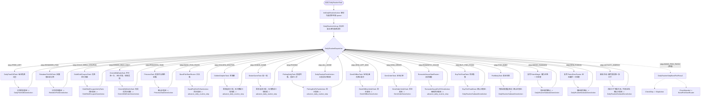

# 日常收尾总控任务 (docs/features/daily-routine.md)

2026-10-07：v0.7.8 首次完整单独运行成功，但日志暴露 Focus 半角斜杠会被 MFAAvalonia 误当本地路径。挂机好友时段改为“十点、二十二点”，并由 Pipeline 通用门禁禁止静态 Focus 使用 `/`；调度时点、队列和完成状态不变。代码级验证完成，本次未操作 MFA/模拟器。

**最后更新**: 2026-10-09

### 2026-10-09 手动完整运行后的重复调度

10 月 8 日晚自动日常在乐队鱼网络断线弹窗处失败，内存中的 `resume_stack=['patrol']` 未被弹出。10 月 9 日 13:49 用户单独运行了与十二点默认日程同范围的全部子任务，14:00:28 完成；旧栈使这次手动任务继续到巡检，且 `noon_daily_last_date` 当天仍为空，14:00:32 又自动启动完整日常。日志直接证明这次重复执行，而非单纯的识别器轮询。

现在仅由实际启动的 Action 修改状态：独立日常 Init 清除上次失败留下的挂机返回栈；自动日常 Init 保留本次刚压入的返回目标。独立日常若覆盖十二点默认的全部 12 项且到 `DailyRoutineFinishAction`，才将当天写入原有自然日去重日期，防止手动完成后再自动重跑；部分勾选、失败和中途停止不覆盖日程。自动日常仍在启动前持久化“已尝试”日期，含义与原规则一致。落盘失败时仅在当前 Agent 内抑制重复并警告重启后仍有风险。代码级验证完成，本轮未做 MFA／模拟器测试。
**版本**: v16（绿野/公主按勾选各执行一次，位于乐队鱼回访之后）
**状态**: 已实现串行容器、自由多选组合、逐项日志、宝石订单、绿野寻仙踪日常及乐队鱼异步调度；已落地双出口路由消除独立运行超时失败。

**2026-10-02 新报告修复**：鱼宝牛奶结束自动回主页兼容直接退出；浪漫满屋木牌中心点击、主页门禁下最多三次重试，去除错误恢复环。两项失败出口保留原生 `FAILED`，不会误显示成功；只有各自确认回主鱼缸才推进队列。新专项含原生框架文件图片回放通过，本次未做 MFA/模拟器测试，详见对应功能文档。

### 挂机日程跨 Agent 重启去重（2026-10-02）

好友摸宝 10:00–11:59、22:00–23:59 两档和日常收尾 12:00–23:59 档，沿用按自然日“每档自动尝试一次”的语义。开始执行前，将对应日期写入本机 `%LOCALAPPDATA%/MaaHappyFish/state.json` 的 `hangup_schedule`；Agent 启动只恢复三项已启动日期，不恢复旧页面、返回栈或业务完成状态。Recognition 只读内存、不落盘；持久化在真正激活的初始化 Action 中完成，写入失败不启动子任务。复用现有原子写入且保留海獭等其它状态。

11:31 重建 Agent 后，纯内存 latch 清零，11:36 同一上午档重复触发，现已堵住此路线。日期表示“已自动尝试”，不是“已成功领奖”；失败后的同档不因重启自动重复消耗，仍可手动启动独立任务处理。跨自然日重新允许触发，凌晨 00:00–09:59 不补发晚上档，不套用海獭 04:00 游戏日。真实子进程重启、下一日/窗口、写入失败与三个初始化入口测试通过，未做实机测试。

**2026-10-06 留言箱**：好友摸宝仍不是日常收尾勾选子任务。十点/二十二点挂机好友摸宝如果先进入留言箱，按正在运行的收鱼产物或多鱼缸巡检任务上的「留言箱」选项处理；单独运行好友摸宝或日常收尾时，用那个任务自己的同名选项。默认全部不处理。详见 [friend-gem.md](friend-gem.md)。代码级验证，未跑 MFA。

**2026-09-27 验证**：购买鱼食/鱼宝日常接入的 6 项 `dev/test_daily_routine_food_baby.py`、既有购买专项与 8 项鱼宝专项、241 条正则/819 节点资源加载、Agent 引用、三份界面一致性/更新契约及 Python 编译通过。本次未做 MFA/模拟器测试。

**2026-10-01 顺序优化**：取消末尾无条件二次领取。其它已选子任务完成后，先乐队鱼 Pass 2 回访，再绿野寻仙踪日常，最后公主任务；绿野/公主未勾选则跳过。绿野同一次子任务先开贝壳、买鱼，再复用 `GreenWildTask` 领取任务/等级奖励，领奖退出并确认主鱼缸后才提交完成。调度组合、空勾选、单项、重复结算、绿野/公主及相关日常专项和静态门禁完成代码级验证，本次未做 MFA/模拟器测试。

**2026-09-28 新增**：魔力召唤与宝石融合各设一个默认关闭的日常子任务开关。每次日常队列仅检查一次，复用巡检原有页面门禁、结果处理和资源确认，不复用每小时计时器；两项均在鱼宝乐园后、乐队鱼回访前执行。完成后由鱼缸 1/2/3 主页面编号模板确认回缸，才推进日常队列。当前为代码级实现，未做 MFA/模拟器验证。

**2026-09-28 活动体力**：新增默认关闭的「领取活动体力（酿月食香）」子任务，只检查当前精彩活动列表的第一张卡片。主鱼缸入口、活动列表返回、卡片名称、酿月食香关闭和可选“收下”均按当前画面验证；最后确认回缸再推进队列。其它卡片和外链保持不支持。详情见 [activity-energy.md](activity-energy.md)。本次仅做代码级验证，未操作 MFA/模拟器。

---

## 一、功能定位与设计目标

开心水族箱小助手中存在多个每日固定执行的维护与活动任务：
- **每日免费礼包** (`DailyFreeGiftTask`)
- **驯鹿鱼送收礼物** (`ReindeerFishGiftTask`)
- **兑换金贝壳券** (`GoldShellCouponTask`)
- **绿野寻仙踪日常** (`GreenWildDailyTask`)
- **乐队鱼演出** (`BandFishTask`)
- **金海豚小游戏** (`GoldenDolphinTask`)
- **摇一摇小游戏** (`ShakeGameTask`)
- **钓鱼达人** (`FishingTask`)
- **宝石礼盒兑换** (`GemGiftBoxTask`)
- **宝石订单** (`GemOrderTask`)
- **浪漫满屋** (`RomanticHouseTask`)
- **购买鱼食** (`BuyFishFoodTask`)
- **鱼宝乐园** (`FishBabyTask`)
- **魔力召唤**（复用多鱼缸巡检流程）
- **宝石融合**（复用多鱼缸巡检流程）
- **领取活动体力**（当前仅酿月食香）

在 Phase 2 中，【日常收尾】(`DailyRoutineTask`) 明确降级为确定性的**“串行任务容器”**：
1. **自由多选组合**：用户可在 MFAAvalonia 界面中按需自由勾选任意子任务组合；
2. **固定异步顺序**：勾选乐队鱼时，先执行乐队鱼 Pass 1 发出邀请；随后按勾选执行每日免费礼包、驯鹿鱼送收礼物、兑换金贝壳券、秘境之门（当前 UI 隐藏）、金海豚、摇一摇、钓鱼达人、宝石礼盒兑换、宝石订单、浪漫满屋、购买鱼食、鱼宝乐园、魔力召唤、宝石融合、领取活动体力；再执行乐队鱼 Pass 2 回访演出；最后按勾选执行绿野寻仙踪日常、公主任务。未勾选的子任务不入队；
3. **安全退出保障**：每个子任务执行结束（成功、次数用尽、体力不足等）后，必须 100% 返回主鱼缸珊瑚，方可推进下一任务；
4. **两阶段异步执行**：乐队鱼 Pass 1 / Pass 2 已接入调度；中间任务的执行时间用于等待人机好友接受邀请。
5. **末尾各执行一次**：绿野寻仙踪日常完成“开贝壳+买鱼+领奖”完整子流程，公主任务在赏金奖励页点击「交付任务」，满五次后开启福袋，再进入公主日记检查奖励列与额外宝箱。二者都位于乐队鱼回访之后，以覆盖此前活动完成的任务条件；不再有独立的 `GREEN_WILD_CLAIM` / `PRINCESS_CLAIM` 队列步骤。每次进入 `PrincessTask` 仍重置三格、交付按钮和开福袋的 `max_hit` 计数。日记每格本次最多点击一次，交付任务本次最多 8 次，福袋最多开一次。

---

## 二、任务开关与参数传递契约 (PI V2)

### 1. 界面选项声明 (`interface.json`)
在 `interface.json` 的 `DailyRoutineTask` 下配置 `checkbox` 类型的任务选项 `日常收尾任务`：
- **类型**: `"type": "checkbox"`
- **默认值**: 保留原五项默认选择（乐队鱼、金海豚、摇一摇、钓鱼达人、浪漫满屋）；“每日免费礼包”、“驯鹿鱼送收礼物”、“兑换金贝壳券”、“绿野寻仙踪日常”、“宝石礼盒兑换”与“宝石订单”默认不勾选，由用户按需主动开启。
- **Cases 与 Pipeline Override**:
  每个 case 独立覆盖 pipeline 中的专有使能节点，互不冲突：
  - `每日免费礼包` → `DailyRoutineEnableFreeGift: { "enabled": true }`
  - `驯鹿鱼送收礼物` → `DailyRoutineEnableReindeerFish: { "enabled": true }`
  - `兑换金贝壳券` → `DailyRoutineEnableGoldShellCoupon: { "enabled": true }`
  - `绿野寻仙踪日常` → `DailyRoutineEnableGreenWildDaily: { "enabled": true }`
  - `乐队鱼` $\rightarrow$ `DailyRoutineEnableBandFish: { "enabled": true }`
  - `金海豚` $\rightarrow$ `DailyRoutineEnableGoldenDolphin: { "enabled": true }`
  - `摇一摇` $\rightarrow$ `DailyRoutineEnableShakeGame: { "enabled": true }`
  - `钓鱼达人` $\rightarrow$ `DailyRoutineEnableFishing: { "enabled": true }`
  - `宝石礼盒兑换` $\rightarrow$ `DailyRoutineEnableGemGiftBox: { "enabled": true }`
  - `宝石订单` $\rightarrow$ `DailyRoutineEnableGemOrder: { "enabled": true }`
  - `浪漫满屋` $\rightarrow$ `DailyRoutineEnableRomanticHouse: { "enabled": true }`
  - `购买鱼食` → `DailyRoutineEnableBuyFishFood: { "enabled": true }`；case 的 `option` 仍引用 `购买廉价鱼食袋数`。同一选项有廉价袋数、普通袋数、高级袋数，后两个默认 0。两个购买节点一起收到这三项。
  - `鱼宝乐园` → `DailyRoutineEnableFishBaby: { "enabled": true }`；case 的 `option` 引用独立任务同样的喂食、玩耍、喂奶设置，保留逐只/一键配置和资源门禁。
  - `魔力召唤` → `DailyRoutineEnableMagicSummon: { "enabled": true }`；一次检查沿用巡检的高级召唤门禁。
  - `宝石融合` → `DailyRoutineEnableGemFusion: { "enabled": true }`；一次检查沿用巡检的融合/入库流程。
  - `领取活动体力（酿月食香）` → `DailyRoutineEnableActivityEnergy: { "enabled": true }`；只处理当前第一张卡片，默认不勾选。

购买鱼食、鱼宝乐园、魔力召唤、宝石融合和活动体力默认不勾选。挂机定时插入的历史 `all_enabled` 范围保持原样，不隐式启用这五项；直接传参可显式设 `buy_fish_food`、`fish_baby`、`magic_summon`、`gem_fusion`、`activity_energy`。玩耍配置全为跳过仍表示整只宝宝不参与，日常模式确认主鱼缸后标记 `SKIPPED` 并继续；若此时处于鱼宝中间页，安全停止而不直接流转。

### 2. 独立调试入口管理
- **浪漫满屋 (`RomanticHouseTask`)**：因功能已全面测试完毕并达成 100% 闭环，从三份 `interface.json` 的任务列表中移除独立入口，统一通过日常收尾入口运行；
- **保留独立入口**：`BandFishTask`、`GoldenDolphinTask`、`ShakeGameTask`、`FishingTask`、`GemGiftBoxTask`、`GemOrderTask`、`GoldShellCouponTask` 保留在 `interface.json` 中，供后续专项调试使用。
- **共享子任务参数**：`DailyRoutineTask` 同时显示“乐队鱼乐章”“金海豚奖励优先级”“钓鱼地点”和“钓鱼饵食适配模式”；金海豚可选择四类最高优先级，钓鱼普通模式固定 5 杆，美味模式不限杆数并由用户手动停止。

---

## 三、调度器与状态机架构


```mermaid
flowchart TD
    Start([启动 DailyRoutineTask]) --> Init[InitDailyRoutineAction: 解析勾选项并组装 queue]
    Init --> InitLog[DailyRoutineInitLog: 显示已选与未勾选跳过项]
    InitLog --> Dispatcher{DailyRoutineDispatcher}

    %% 步骤分发
    Dispatcher -- step=FREE_GIFT --> FG[DailyFreeGiftTask: 每日免费礼包]
    Dispatcher -- step=REINDEER_FISH --> RF[ReindeerFishGiftTask: 驯鹿鱼送收礼物]
    Dispatcher -- step=GOLD_SHELL_COUPON --> GSC[GoldShellCouponTask: 兑换金贝壳券]
    Dispatcher -- step=GREEN_WILD_DAILY --> GWD[GreenWildDailyTask: 开贝壳一次、买贝币鱼、领取奖励]
    Dispatcher -- step=PRINCESS_TASK --> PT[PrincessTask: 奖励列与额外宝箱]
    Dispatcher -- step=BAND_FISH_PASS1 --> BF[BandFishStartRouter: 乐队鱼]
    Dispatcher -- step=GOLDEN_DOLPHIN --> GD[GoldenDolphinTask: 金海豚]
    Dispatcher -- step=SHAKE_GAME --> SG[ShakeGameTask: 摇一摇]
    Dispatcher -- step=FISHING --> FI[FishingDailyTask: 普通饵食、固定 5 杆]
    Dispatcher -- step=GEM_GIFT_BOX --> GGB[GemGiftBoxTask: 宝石礼盒兑换七配方]
    Dispatcher -- step=GEM_ORDER --> GO[GemOrderTask: 宝石订单]
    Dispatcher -- step=ROMANTIC_HOUSE --> RH[RomanticHouseStartRouter: 浪漫满屋]
    Dispatcher -- step=BUY_FISH_FOOD --> BFF[BuyFishFoodTask: 购买鱼食]
    Dispatcher -- step=FISH_BABY --> FB[FishBabyTask: 鱼宝乐园]
    Dispatcher -- step=MAGIC_SUMMON --> MS[复用 PatrolMagic: 魔力召唤一次检查]
    Dispatcher -- step=GEM_FUSION --> GF[复用 PatrolGemFusion: 宝石融合一次检查]
    Dispatcher -- step=ACTIVITY_ENERGY --> AE[精彩活动: 酿月食香第一张卡片]
    Dispatcher -- step=ALL_DONE --> Finish[DailyRoutineFinishAction: 汇总报告并结束]

    %% 退出与队列推进
    FG --> FG_Exit[识别回到鱼缸 -> DailyFreeGiftDoneAction]
    RF --> RF_Exit[识别回到鱼缸 -> ReindeerFishDoneAction]
    GSC --> GSC_Exit[GoldShellCouponVerifyTank: 回主鱼缸 -> GoldShellCouponDoneAction]
    GWD --> GWD_Exit[GreenWildVerifyTank: 领奖后回主鱼缸 -> GreenWildClaimDoneAction]
    PT --> PT_Exit[确认主鱼缸 -> PrincessTaskDoneAction]
    BF --> BF_Exit[BandFishExitToTankAction: 回主鱼缸 -> advance_daily_routine_step]
    GD --> GD_Exit[最多连续三局；无次数或三局完成 -> advance_daily_routine_step]
    SG --> SG_Exit[最多连续三局；无次数或三局完成 -> advance_daily_routine_step]
    FI --> FI_Exit[FishingExitToTankAction: 回主鱼缸 -> advance_daily_routine_step]
    GGB --> GGB_Exit[GemGiftBoxVerifyTank: 回主鱼缸 -> GemGiftBoxDoneAction]
    GO --> GO_Exit[GemOrderVerifyTank: 回主鱼缸 -> GemOrderDoneAction]
    RH --> RH_Exit[RomanticHouseExitToTankAction: 珊瑚回主鱼缸 -> advance_daily_routine_step]
    BFF --> BFF_Exit[BuyFishFoodDone: 确认主鱼缸 -> DailyRoutineSubtaskDoneAction]
    FB --> FB_Exit[完成或配置全跳过: 确认主鱼缸 -> DailyRoutineSubtaskDoneAction]
    MS --> MS_Exit[鱼缸编号确认 -> DailyRoutineSubtaskDoneAction]
    GF --> GF_Exit[鱼缸编号确认 -> DailyRoutineSubtaskDoneAction]
    AE --> AE_Exit[活动卡片专属关闭、列表返回、确认主鱼缸 -> DailyRoutineSubtaskDoneAction]

    FG_Exit --> Dispatcher
    RF_Exit --> Dispatcher
    GSC_Exit --> Dispatcher
    GWD_Exit --> Dispatcher
    PT_Exit --> Dispatcher
    BF_Exit --> Dispatcher
    GD_Exit --> Dispatcher
    SG_Exit --> Dispatcher
    FI_Exit --> Dispatcher
    GGB_Exit --> Dispatcher
    GO_Exit --> Dispatcher
    RH_Exit --> Dispatcher
    BFF_Exit --> Dispatcher
    FB_Exit --> Dispatcher
    MS_Exit --> Dispatcher
    GF_Exit --> Dispatcher
    AE_Exit --> Dispatcher

    %% 保留的两阶段拓扑 (Pass 2)
    Dispatcher -. step=BAND_FISH_PASS2 (保留) .-> P2[DailyRoutineStepBandFishPass2]
    P2 -.-> P2_Skip[CheckSkip -> SkipAction]
    P2 -.-> P2_Run[CheckNeeded -> BandFishStartRouter]
```

---

## 四、核心模块实现

### 1. 运行时状态管理 (`agent/runtime_state.py`)
- `daily_routine_state`:
  ```python
  daily_routine_state = {
      "active": False,
      "step": "INIT",
      "queue": [],  # 待执行的后续子任务序列
      "tasks": {
          "FreeGift": {"status": "IDLE"},
          "ReindeerFish": {"status": "IDLE"},
          "GoldShellCoupon": {"status": "IDLE"},
          "BandFish": {"status": "IDLE", "stage": "PASS1"},
          "GoldenDolphin": {"status": "IDLE"},
          "ShakeGame": {"status": "IDLE"},
          "Fishing": {"status": "IDLE"},
          "GemGiftBox": {"status": "IDLE"},
          "GemOrder": {"status": "IDLE"},
          "RomanticHouse": {"status": "IDLE"},
          "BuyFishFood": {"status": "IDLE"},
          "FishBaby": {"status": "IDLE"},
          "MagicSummon": {"status": "IDLE"},
          "GemFusion": {"status": "IDLE"},
          "ActivityEnergy": {"status": "IDLE"},
      },
  }
  ```

### 2. 队列推进逻辑 (`agent/my_action.py`)
- **`advance_daily_routine_step(task_name, biz_status)`**:
  - 记录子任务状态（`DONE` / `NO_STAMINA` / `PENDING`）；
  - 若 `queue` 尚有任务，弹出首项赋给 `step`；
  - 若 `queue` 已空，置 `step = "ALL_DONE"`；
- **`InitDailyRoutineAction`**:
  - 优先解析 `custom_action_param`（支持单元测试与直接调用）；
  - 否则通过 `context.get_node_data()` 读取各 `DailyRoutineEnable*` 节点的 `enabled` 状态，包括购买鱼食、鱼宝乐园、魔力召唤、宝石融合和活动体力；
  - 按上述固定顺序组装待执行队列；仅加入已选任务，空勾选直接进入 `ALL_DONE`；绿野/公主在乐队鱼回访之后各入队一次；
  - 初始化后通过 `DailyRoutineInitLog` 在 MFA 日志展示“已选择”和“因未勾选跳过”摘要；每个 `DailyRoutineStep*` 在真正分发前显示“开始执行”，避免摇一摇等任务看起来被静默跳过。
- **`GoldShellCouponDoneAction`**:
  - 主鱼缸验证成功后调用 `advance_daily_routine_step("GoldShellCoupon", "DONE")`，推进流水线经双出口路由返回 `DailyRoutineDispatcher`。
- **`GemGiftBoxDoneAction`**:
  - 主鱼缸验证成功后调用 `advance_daily_routine_step("GemGiftBox", "DONE")`，推进流水线经双出口路由返回 `DailyRoutineDispatcher`。
- **`GemGiftBoxSkipAction`**:
  - 宝石礼盒入口或中途页面等待超时、或启动时停在无法归属的兑换弹窗时调用。只在日常收尾激活且当前步骤仍是 `GEM_GIFT_BOX` 时写入 `SKIPPED` 并推进一次。随后尽量确认主鱼缸或点击「返回」，再回到调度器；不使用 `StopTask`，因此不会把外层多鱼缸巡检判失败。独立运行仍由 `FailTaskAction` 报告失败。
- **`GemOrderDoneAction`**:
  - 主鱼缸验证成功后调用 `advance_daily_routine_step("GemOrder", "DONE")`；日常模式继续队列，独立模式正常结束。
- **`DailyRoutineSubtaskDoneAction`**：购买鱼食、鱼宝、魔力召唤、宝石融合与活动体力共用的完成提交。只在主鱼缸模板门禁激活后执行；仅当日常 active 且当前步骤等于参数中的 `expected_step` 时写入 `DONE` / `SKIPPED` 并推进，重复提交和独立运行均不推进。失败 StopTask。
- **`RomanticHouseExitToTankAction`**:
  - 标记 `RomanticHouse` 状态为 `DONE`，调用 `advance_daily_routine_step`，推进流水线回到 `DailyRoutineDispatcher`。

### 3. 子任务物理归位保障
| 子任务 | 退出触发点 | 返回主鱼缸实现 |
| --- | --- | --- |
| **每日免费礼包** | 领取成功或识别到已售罄 | OCR 点击充值页左上角“返回”，模板确认鱼缸后推进队列 |
| **驯鹿鱼送收礼物** | 一键收取，或一键回礼后直接返回/直接赠送 | OCR 点击通用返回，模板确认鱼缸后推进队列 |
| **兑换金贝壳券** | 完成兑换或复核未识别到兑换按钮 | 状态驱动两级返回：金贝壳主页返回 $\rightarrow$ 模板确认退回分类页 $\rightarrow$ 分类页返回 $\rightarrow$ 模板确认回到主鱼缸，触发 `GoldShellCouponDoneAction` |
| **乐队鱼** | 邀请完成或无空位 | `BandFishExitToTankAction`：点击左上角返回 `(91, 46)` + 保底关闭面板 `(640, 150)` |
| **金海豚** | 按用户选择的最高优先级全屏处理四类奖励；每局结束后未满 3 局则重进；第 3 局完成或机会耗尽 | `GoldenDolphinExitAction` 等待结算模板、点击实际命中位置，并以主界面模板确认物理归位后才记录局数；`NO_STAMINA` 关闭提示并完成同一归位门禁后才推进队列 |
| **摇一摇** | 每局结束后未满 3 局则重进；第 3 局完成或次数耗尽 | `ShakeGameExitAction` 记录局数并重进；`NO_STAMINA` 正常推进队列；退出后接入双出口路由 |
| **钓鱼达人** | 普通模式由 `FishingDailyTask` 重选黄色奶酪并固定 5 杆；美味模式由 `FishingDailySpecialTask` 沿用手选鱼饵、不限杆数、手动停止 | 依次识别点击钓场与地点页右上角退出；以 `主界面特征.png` 确认回缸后才由 `FishingDoneAction` 推进队列 |
| **宝石礼盒兑换** | 7 个等级配方巡检并兑换/跳过完毕 | `GemGiftBoxVerifyTank` 命中 `主界面特征.png` 后触发 `GemGiftBoxDoneAction` 推进队列并接入双出口路由 |
| **宝石订单** | 达到 10/10；可完成订单点完成，不可完成订单双确认丢弃 | `GemOrderVerifyTank` 命中 `主界面特征.png` 后触发 `GemOrderDoneAction`，接入日常/独立双出口 |
| **魔力召唤** | 一次检查当前召唤页；沿用巡检对进行中/结果/高级召唤的判断 | 从已知召唤页或主鱼缸进入巡检现有流程；返回后必须命中鱼缸 1/2/3 编号，才提交完成 |
| **宝石融合** | 一次检查当前融合页；沿用巡检对入库/进行中的判断 | 从已知入库弹窗、融合页或主鱼缸进入巡检现有流程；返回后必须命中鱼缸 1/2/3 编号，才提交完成 |
| **领取活动体力** | 酿月食香页有“收下”则点实际文字；没有就直接退出 | 专属关闭按钮 → 活动列表返回按钮 → 主鱼缸模板，逐层确认后提交完成 |
| **浪漫满屋** | 10次点赞完成或已满 | 双级心形关闭 `(1197, 57)` + 状态验证回主鱼缸珊瑚 + `RomanticHouseExitToTankAction` |

魔力召唤与宝石融合的日常 Start Contract：只支持上述可识别页面。未知页面无法满足入口视觉门禁时安全停止；不根据历史队列状态盲点入口。两项只执行本次队列中的一次检查，巡检独立任务的 3600 秒计时语义保持不变。

### 4. 独立运行与日常收尾双出口路由架构 (Dual-Exit Routing Contract)

开心水族箱存在多个既可作为**独立任务**单独勾选运行，又可作为**日常收尾子任务**串行调度的功能（如摇一摇、金海豚、钓鱼达人、宝石礼盒兑换等）。

#### 根因与设计原则
- **问题根因**：若各子任务在返回主鱼缸确认后，终态节点硬编码指向 `DailyRoutineDispatcher`，在独立运行模式下（`daily_routine_state["active"] == False`），进入 Dispatcher 后的所有 Step 判定条件均不满足，MaaFramework 持续重试 20 秒超时后触发 `NextList.Failed`，最终在 UI 判定为任务运行失败；
- **禁止语义伪装**：严禁在 `CheckDailyRoutineStepReco` 中通过“若未激活则命中 ALL_DONE”来压制错误，因为“日常未激活”绝不等于“日常任务全部完成”，此种做法会混淆业务语义并导致虚假执行报告；
- **双出口分流规范**：所有子任务终态节点统一接入共享双出口路由：

```text
子任务终态节点 (如 ShakeGameVerifyTank / GoldenDolphinDone / GemGiftBoxVerifyTank)
                     │
                     ▼
        ┌────────────────────────────┐
        │  next:                     │
        │  DailyRoutineReturnIfActive│
        │  DailyRoutineStandaloneDone│
        └──────────────┬─────────────┘
                       │
         ┌─────────────┴─────────────┐
         ▼                           ▼
DailyRoutineReturnIfActive   DailyRoutineStandaloneDone
(CheckDailyRoutineActiveReco)  (DirectHit -> DoNothing 叶子节点)
         │                           │
         ▼ (active == True)          ▼ (active == False)
DailyRoutineDispatcher        任务成功正常退出 (ret=true)
```

- **静态契约门禁**：`dev/test_daily_routine_scheduler.py` 中的 `test_architecture_contract_no_hardcoded_dispatcher` 确保所有日常子任务终态节点均接入双出口路由，严禁任何子任务直接硬编码指向 `DailyRoutineDispatcher`。

### 每日免费礼包分支契约

入口模板 `充值页面入口.png` 仍是钞票图标，裁剪范围 `[505,33,40,32]`，搜索范围 `[455,0,140,115]`，阈值 0.8。2026-09-30 的失败截图上该模板得分 0.9886，命中框就是 `[505,33,40,32]`，但点击落在框的左下角 `(507,61)`，点中的是钞票图标而不是它右侧的加号，充值页因此没有打开。识别仍用这张模板确认鱼缸入口还在，点击改为加号中心的固定点 `[652,48,6,6]`。若点完仍停在鱼缸（同一模板仍命中）且还没认出「超值礼包」，再点一次同一个点，然后仍必须认出「超值礼包」，否则安全停止。不再对同一区域做「充值|商城」OCR，也不把阈值降到 0.75。

```text
鱼缸 -> 模板确认后点击顶部加号 -> OCR 点击“超值礼包”
                         ├─ OCR“免费领取” -> 点击 -> OCR 点击弹窗“返回” ┐
                         └─ OCR“售罄”（兼容“已售罄”）----------------┤
                                                                    -> OCR 点击左上角“返回” -> 模板确认鱼缸
```

领取成功后直接退出，不再检查“已售罄”。任务也支持从领取成功弹窗、已售罄页、可领取页或充值页恢复；重复执行时，“已售罄”是正常完成分支，不记为错误。实机 OCR 可能省略首字而只返回“售罄”，因此该分支使用稳定子串“售罄”匹配两种结果，并保持在“免费领取”分支之前，避免灰色禁用按钮造成误判。

#### 实机测试状态（2026-09-08）

| 分支 | MFA 实机状态 | 已确认范围 / 待验证范围 |
| --- | --- | --- |
| 礼包已领取（“售罄”分支） | **已通过** | 已确认能够识别“售罄/已售罄”、点击左上角“返回”并正常结束，不会把重复执行视为错误。 |
| 礼包可领取（“免费领取”分支） | **已通过** | 已确认能够识别并点击“免费领取” → 识别并点击领取成功弹窗中的“返回” → 点击充值页左上角“返回” → 确认回到鱼缸。 |

上述两条分支均已由用户在 MFA 中完成实机测试；每日免费礼包现已具备可领取与重复执行已售罄两条完整闭环。

### 驯鹿鱼送收礼物分支契约

驯鹿鱼是默认关闭的日常子任务。已接入“一键收取”和“一键回礼”两种页面分支；回礼后若全屏 OCR 识别到“直接赠送”则点击，否则直接识别左上角通用返回。详细节点、ROI 和未测试边界见 `docs/features/reindeer-fish.md`。

**实机状态：部分测试。** 已确认能够进入单按钮布局的“一键收取”页面与双按钮布局的“一键回礼”页面；二者是并列分支，不是 ROI 替换关系。2026-09-15 已根据现场日志把共享回礼节点改为在 `[537,611,128,44]` 识别稳定子串“键回礼”并点击，代码级验证完成；点击后的直接赠送/返回链仍待 MFA 复测。

---

## 五、验证与测试

运行调度器全场景测试套件：
```powershell
python dev/test_daily_routine_scheduler.py
```
覆盖用例：
1. **组合 1（全选）**: 乐队鱼 Pass 1 $\rightarrow$ 每日免费礼包 $\rightarrow$ 驯鹿鱼送收礼物 $\rightarrow$ 兑换金贝壳券 $\rightarrow$ 金海豚 $\rightarrow$ 摇一摇 $\rightarrow$ 钓鱼达人 $\rightarrow$ 宝石礼盒兑换 $\rightarrow$ 宝石订单 $\rightarrow$ 浪漫满屋 $\rightarrow$ 乐队鱼 Pass 2 $\rightarrow$ ALL_DONE
2. **组合 2（仅浪漫满屋）**: 浪漫满屋 $\rightarrow$ ALL_DONE
3. **仅每日免费礼包**: FREE_GIFT $\rightarrow$ ALL_DONE
4. **仅驯鹿鱼送收礼物**: REINDEER_FISH $\rightarrow$ ALL_DONE
5. **组合 3（仅金海豚）**: 金海豚 $\rightarrow$ ALL_DONE
6. **组合 4（浪漫满屋 + 钓鱼达人）**: 钓鱼达人 $\rightarrow$ 浪漫满屋 $\rightarrow$ ALL_DONE
7. **组合 5（空勾选）**: 直接跳过 $\rightarrow$ ALL_DONE
8. **组合 6（仅乐队鱼）**: Pass 1 $\rightarrow$ Pass 2 $\rightarrow$ ALL_DONE
9. **组合 7（仅宝石礼盒兑换）**: GEM_GIFT_BOX $\rightarrow$ ALL_DONE
10. **Pipeline 拓扑与分支检查**: 校验 10 个 Enable 节点、11 个 Dispatcher 候选（含 `GEM_GIFT_BOX` 与 `GEM_ORDER`），以及每日礼包、驯鹿鱼、宝石礼盒、宝石订单的分支契约
11. **UI Pipeline Override 节点读取与契约测试**: 模拟 MFA 传入 override 的完整流转，覆盖 6 种日常收尾勾选 cases
12. **独立执行保护**: `active=False` 时各子任务退出互不影响（`GemGiftBoxVerifyTank` 双出口分流至 `DailyRoutineStandaloneDone`）
13. **乐队鱼运行模式分流**: 日常模式返回调度器；独立待接受状态退出重进；独立完成状态正常结束
14. **金海豚连续执行**: 两次 `NEXT_ROUND` 后第 3 局 `DONE`；任意入口 `NO_STAMINA` 均正常推进下一任务
15. **钓鱼耗尽兼容**: 精确模板与 ROI 在开始、选饵、等待结算和循环阶段均优先识别；命中后复用右上角退出和主鱼缸确认链
16. **金海豚跨任务归位门禁**: 结算页出现较晚时等待取消模板并确认返回主鱼缸；未通过门禁不得推进到摇一摇等后续任务
17. **可见流转日志**: 初始化摘要包含所有已选与未勾选项；每个 Dispatcher 步骤在进入具体子任务前输出开始日志。

#### 乐队鱼异步实机测试状态（2026-09-08）

| 路径 | MFA 实机状态 | 已确认范围 / 待验证范围 |
| --- | --- | --- |
| 独立任务邀请 | **部分通过** | 已确认四位指定人机好友均能成功邀请并退出；旧流程随后误入未激活的日常调度器，本次已完成代码修复。 |
| 最新乐章定位 | **已通过** | 已确认能够自动下滑到列表底部并定位最末乐曲；这不等同于完整演奏通过。 |
| 体力耗尽退出 | **已通过** | 已确认体力用完时能够正常退出，不报错、不触发付费返场。 |
| 体力可用的完整演奏 | **尚未测试** | 待验证确认消耗体力、演奏、跳过按钮和结算领取的完整流程。 |
| 独立任务完整闭环 | **尚待复测** | 待验证单次运行内自动完成“邀请 → 退出 → 识别游乐园 → 识别乐队鱼入口 → 确认就绪 → 演出”。 |
| 日常收尾异步闭环 | **尚未测试** | 待验证 Pass 1 最先邀请、其他子任务继续执行、Pass 2 最后回访并演出。 |
